<!-- Badges : syntaxe, styles et encodage des URL shields.io
     https://github.com/badges/shields
     espace = %20 · barre verticale = %7C · tiret littéral = --
     « langues » désigne l'interface du plugin, traduite ;
     un badge « docs » ne couvrirait que cette documentation. -->

<div align="center">


# CanaPlan

**Plugin QGIS de dessin topologique de réseaux d'assainissement et d'eau potable — EU / EP / AEP, du tracé terrain à la livraison StaR-Eau**

[](https://qgis.org)
[](#-changelog)
[](https://qgis.org)
[](#-export-star-eau-cnig--astee-v2024)
[](#-langues--languages)

**[Français](#-français) · [English](#-english) · [Español](#-español) · [Português](#-português) · [Deutsch](#-deutsch)**

</div>

---

## 🇫🇷 Français

## 📝 Description

**CanaPlan** est un logiciel de dessin projet qui permet de tracer des réseaux d'assainissement **EU** (Eaux Usées) et **EP** (Eaux Pluviales), et depuis la 2.2 des réseaux d'eau potable **AEP**, directement dans QGIS, sur un fond de carte importé directement par le plugin (BAN, cadastre PCI, orthophoto IGN, OSM, ou plan DXF/DWG existant), avec continuité géométrique native : chaque conduite relie deux ouvrages, chaque branchement se recale automatiquement sur sa conduite mère quand elle bouge, avec validation à l'enregistrement.

> ### ⚠️ CanaPlan n'est **pas** un outil de saisie manuelle
>
> Il s'utilise de deux façons, **également complètes** : à la souris, et **par script**. Un chantier entier — création du projet, chargement des fonds, tracé du collecteur sur l'axe OSM de la voie, un branchement par habitation jusqu'à la limite de parcelle, terrain naturel relevé sur le MNT IGN, cotes, étiquettes, plan PDF — se joue **en un seul appel, sans aucun clic**.
>
> ```python
> from CanaPlan.tools import api
> api.aide()        # sommaire : verbes disponibles et recettes livrées
> ```
>
> `api.aide()` est auto-descriptif : il rend les recettes, leurs paramètres requis et un exemple d'appel pour chacune. **C'est le seul point d'entrée à connaître** — depuis la console Python de QGIS, un script, un serveur MCP ou un agent. Voir [🤖 Pilotage par script](#-pilotage-par-script).

> ### 🌍 En France et à l'international
>
> Un projet est **France** — Lambert 93, BAN, cadastre, orthophoto et MNT IGN, StaR-Eau — ou **International** : adresses et bâti **OpenStreetMap**, photo aérienne **Esri World Imagery**, système de coordonnées **UTM** proposé d'après l'adresse. Un garde-fou mesure, au chantier, l'écart des longueurs du système choisi et refuse les systèmes en degrés ou en pieds : laissé en Lambert 93, un projet à Abidjan allongeait toutes les longueurs de 25 % sans un message. Voir [🌍 Territoire France / International](#-territoire-france--international).

> ### 💧 Eau potable (AEP)
>
> Depuis la **2.2**, l'AEP est un troisième réseau à part entière : conduites, branchements, nœuds et compteurs, avec les **symboles du géostandard StaR-Eau**. Un nœud à chaque sommet, un robinet de branchement posé au piquage, des appareils (vanne, ventouse, vidange, poteau et bouche incendie, réducteur de pression, compteur de réseau) choisis d'un clic, un fil d'eau déduit de la couverture. Profils, cubature, coupes, renumérotation, plans PDF / DXF et export StaR-Eau le traitent comme EU et EP. Voir [💧 Réseau AEP — eau potable](#-réseau-aep--eau-potable).

> ### 📐 SchemAEP : le schéma de pièces de chaque nœud
>
> Choisi dans la liste des nœuds ou cliqué sur la carte, un nœud AEP s'ouvre dans **SchemAEP**, un éditeur de schémas de montage (tés, vannes, brides, emboîtements, poteaux…) déjà pré-rempli avec les conduites qui arrivent au nœud et l'appareil de son type. Contrôle des assemblages, nomenclature, schéma rangé sur le nœud dans le `.bet`, et à l'export : **6 schémas par page A4** et fichiers SVG. Voir [📐 SchemAEP](#-schemaep--schémas-de-nœuds-aep).

La pente du réseau peut être définie ou rectifiée directement avec les outils de dessin et de saisie (assistant de création de projet en 4 étapes, tableau de saisie groupée). L'outil produit les profils en long (EU/EP/groupé), calcule les volumes de cubature (déblai et matériaux de remblai rapportés), génère des coupes de tranchée transversales, imprime les plans au format PDF multi-feuilles orientables avec plan d'ensemble et permet d'exporter en DXF 2018 fidèle.

Du relevé terrain jusqu'à la livraison, un seul outil couvre toute la chaîne : import Star-DT / StaR-Elec (DT-DICT), fonds de plan IGN/BAN/PCI chargés en tâche de fond, et export GeoPackage conforme au géostandard **StaR-Eau V2024** (CNIG / ASTEE).

### 🗂️ Sommaire

- [⚙️ Fonctionnalités](#-fonctionnalites)
- [🖼️ Captures d'écran](#-captures-décran)
- [💧 Réseau AEP — eau potable](#-réseau-aep--eau-potable)
- [📐 SchemAEP — schémas de nœuds AEP](#-schemaep--schémas-de-nœuds-aep)
- [🪄 Magic Box](#-magic-box)
- [🖥️ Interface](#-interface)
- [🗃️ Couches et attributs](#-couches-et-attributs)
- [🎨 Symbologie](#-symbologie)
- [⌨️ Raccourcis clavier](#-raccourcis-clavier)
- [📥 Import Star-DT / StaR-Elec](#-import-star-dt--star-elec-dt-dict)
- [📤 Export StaR-Eau](#-export-star-eau-cnig--astee-v2024)
- [📦 Format de projet .bet](#-format-de-projet-bet)
- [🌍 Territoire France / International](#-territoire-france--international)
- [📌 Avertissement d'usage](#-avertissement-dusage)
- [🤖 Pilotage par script](#-pilotage-par-script)
- [🚀 Installation](#-installation)
- [🌳 Structure du projet](#-structure-du-projet)
- [📜 Changelog](#-changelog)
- [💡 Genèse du projet](#-genèse-du-projet)
- [👤 Auteur](#-auteur)

---

## ⚙️ Fonctionnalites

### ✏️ Dessin de reseau

| Outil | Description |
|---|---|
| **Conduite EU / EP** | Trace d'une conduite par clics successifs. Chaque sommet genere automatiquement un regard. |
| **Branchement EU / EP** | Piquage sur une conduite existante, trace libre jusqu'a un ouvrage (regard ou tabouret). |
| **Inserer un regard** | Insere un regard sur une conduite existante en cliquant sur la conduite. |
| **Conduite / Branchement AEP** | Meme trace que EU / EP. Chaque sommet de conduite cree un **nœud** (vanne par defaut) ; le branchement pose un **robinet de branchement** au piquage, sans couper la conduite, et un **compteur** au bout. Voir [💧 Réseau AEP](#-réseau-aep--eau-potable). |
| **Poser un appareil AEP** | Clic sur un nœud : menu des types (vanne, ventouse, vidange, poteau incendie…). Clic sur une conduite loin de tout nœud : un nœud est insere et la conduite coupee. |

### 🛠️ Edition

| Outil | Description |
|---|---|
| **Renseigner** | Survol pour mettre en evidence un element (orange), clic pour ouvrir son formulaire d'attributs. Les champs numeriques (TN, FE, profondeur, diametre, longueur, pente, cote piquage) acceptent des **expressions additives** : ex. `1-0.25` -> `0.750`, `2+0.5-0.1` -> `2.400`. Pas de multiplication / division. Le champ recalcule TN / FE / P automatiquement quand l'un des trois est modifie. |
| **Deplacer** | Deplace un ouvrage (regard ou tabouret) et recale automatiquement les conduites et branchements connectes. Permet aussi de deplacer une etiquette (regard / tabouret / conduite / branchement) sans toucher a l'ouvrage. Mode **piquage** : survol du point de piquage d'un branchement (surligne en orange) puis glisser-deposer pour repositionner le piquage le long de la conduite ; met a jour `id_conduite`, `pk_debut`, `cote_piquage` et recale la geometrie du branchement. |
| **Effacer** | Supprime un element et ses etiquettes associees. Lasso possible pour une selection multiple. |
| **Magic Box** | Branchements automatiques sur des troncons choisis a la souris : un par parcelle, par batiment ou par numero de rue, des deux cotes ou d'un seul, avec apercu avant trace. Voir [🪄 Magic Box](#-magic-box). |
| **Copier les attributs** | Copie les attributs (diametre, materiau...) d'un element vers un ou plusieurs autres du meme type. |
| **Tableau de saisie - pente** | Saisie groupee en tableau, par onglets **Regards / Tabourets / Conduites / Branchements**, avec calcul automatique de la pente ou de la cote fil d'eau selon le sens choisi. Apercu carte miniature de l'element selectionne, copier/coller depuis Excel, saisie multi-cellules, historique d'annulation (Ctrl+Z). Un onglet **Chaine** trace le profil simplifie entre deux regards choisis ; en AEP, un **compteur** peut en etre le depart ou l'arrivee (la chaine passe par son branchement et par le robinet de branchement pose sur la conduite). Sur l'onglet Branchements, la **cote de piquage est interpolee sur la conduite mere** au PK du piquage : modifier un fil d'eau de la conduite met a jour en cascade tous les branchements qui y sont piques (cellule affichee en couleur « valeur derivee »). |
| **TN auto (MNT IGN)** | Bouton du Tableau de saisie qui releve le terrain naturel des regards et tabourets du reseau affiche sur le **MNT LiDAR HD (0,50 m)**, avec repli sur le **RGE ALTI (1 m)** la ou le LiDAR HD ne couvre pas. Un dialogue d'apercu affiche, ouvrage par ouvrage, le TN actuel, le TN propose, l'ecart et la source retenue avant toute ecriture : seules les lignes cochees sont appliquees (par defaut, uniquement les TN manquants — case **« Ecraser les TN deja renseignes »** pour forcer). Un ecart superieur a 0,50 m est signale, le MNT decrivant le terrain nu a la date du vol et non le terrain du projet. Le TN ecrit recalcule automatiquement le fil d'eau ou la profondeur selon le choix fait dans le dialogue. L'ensemble du lot s'ecrit en une seule operation (Ctrl+Z annule tout). Le schema des couches ne portant pas de champ de provenance, la tracabilite passe par un **rapport CSV horodate** ecrit dans le dossier du projet (`altimetrie_<reseau>_<horodatage>.csv`), qui liste aussi les ouvrages non appliques. |

#### Modes de calcul du Tableau de saisie

Chaque ligne porte un **cadenas** qui indique quelles valeurs sont saisies et
laquelle est deduite. Convention de signe commune a tout le plugin (profils,
cubature, formulaire Renseigner) : la pente vaut
`(cote amont − cote aval) / longueur × 100`.

| Onglet | Mode | Saisi | Calcule |
|---|---|---|---|
| Conduites | `fe` | FE amont + FE aval | pente |
| Conduites | `pente_aval` | FE amont + pente | FE aval |
| Conduites | `pente_amont` | FE aval + pente | FE amont |
| Branchements | `fe` | cote piquage + FE tabouret | pente |
| Branchements | `pente_fe` | cote piquage + pente | FE tabouret *(applique au tabouret)* |
| Branchements | `pente_cote` | FE tabouret + pente | cote piquage |

Un branchement etant trace **du piquage vers le tabouret**, la pente d'un
branchement vaut `(cote piquage − FE tabouret) / longueur × 100`.

Dans les modes `fe` et `pente_fe`, la cote de piquage reste **asservie a la
conduite mere** : elle est interpolee entre les deux fils d'eau de la conduite
au PK du piquage, et se recalcule automatiquement quand ces fils d'eau
changent. Le mode `pente_cote` rompt volontairement ce lien, puisque la cote
de piquage y devient une valeur calculee a partir de la pente.

### 📊 Analyse

| Outil | Description |
|---|---|
| **Profil en long EU / EP** | Selectionner deux regards pour tracer le profil en long du troncon (BFS). Affiche les cotes TN, radier et la pente. Dialogue d'options (cartouche, fleches piquages, noms, distances, format papier A3/A4). Export PDF/SVG/PNG. Nom de fichier : `{nom_dep}_{nom_arr}_PROFIL.{fmt}`. Necessite **matplotlib**. |
| **Profil groupe EU + EP** | Superpose les profils EU et EP sur le meme graphique. Premier clic = regard depart du reseau de reference, second clic = regard arrivee. Le second reseau est automatiquement projete sur l'axe (buffer 3 m). Nom de fichier : `{eu_dep}_{eu_arr}_{ep_dep}_{ep_arr}_PROFIL.{fmt}`. |
| **Coupe transversale EU** | Trace un axe de coupe sur le reseau EU uniquement. Les conduites croisees sont representees en section avec TN, FE, lit de pose, enrobage, remblai et chaussee. |
| **Coupe transversale EP** | Meme principe sur le reseau EP uniquement. |
| **Coupe transversale des tranchees** | Trace un axe de coupe croisant les reseaux EU et EP simultanement. Genere un plan de coupe A4/A3 (**paysage par defaut**) avec : profil de coupe (tranchees empilees par largeur configuree, cotes NGF), plan de situation (couches QGIS visibles + trait de coupe), titre et cartouche. Export PDF. |
| **Dessinateur – Coupe de tranchees composee** | Dialogue de dessin de coupes de tranchees composees (EU, EP et **AEP** — eau potable, cote a cote). Gestion de N tranches juxtaposees : reseau (EU/EP/AEP), DN, materiau, profondeur fil d'eau, ecarts gauche/droit, lit de pose, enrobage, remblai, chaussee inferieure (GB/GC) et superieure (enrobe). Apercu matplotlib temps reel avec cotes, annotations de couches et couleurs conventionnelles (EU rouge, EP bleu, AEP cyan). Export PDF et PNG (200 dpi). Les valeurs par defaut des couches de remblai heritent de la configuration rapide. Memorisation automatique des dernieres tranches saisies (QgsSettings). Necessite **matplotlib**. |

### 🚧 Cubature et Remblai

| Outil | Description |
|---|---|
| **Cubature / Remblai tranchees** | Calcule le volume de deblai des tranchees. Mode BFS (2 regards), axe trace (buffer 3 m) ou reseau complet. Formule : `Volume = largeur × L3D × (prof_debut + prof_fin) / 2`. Une case a cocher **« Afficher le detail remblai »** dans la fenetre de resultats affiche/masque a la volee les colonnes de decomposition du remblai (lit de pose, enrobage, conduite, chaussee inf/sup, remblai) sans refaire le calcul — parametrage des materiaux et epaisseurs dans la Configuration rapide (onglet Remblai). Sous-totaux par colonne (lineaires, surfaces, volumes) sur chaque ligne de sous-total EU/EP. Onglet/section **Synthese des ouvrages** (tronçons et branchements groupes par materiau/diametre, comptage des regards et tabourets). Fenetre redimensionnable, plein ecran, et qui s'ajuste automatiquement au nombre de lignes et de colonnes affichees. Export CSV, PDF, Excel. |

### 🔢 Renumerotation

| Outil | Description |
|---|---|
| **Renuméroter EU / EP** | Selectionner deux regards pour renumeroter tous les regards et tabourets du chemin (BFS). Un dialogue permet de saisir les prefixes et le numero de depart. |
| **Renuméroter AEP** | Meme selection ; un compteur par type d'appareil (`V01`, `RB01`, `PI01`…), dans l'ordre du chemin. Les robinets de branchement suivent l'ordre des piquages ; coudes, tes, reductions et bouchons ne sont pas numerotes. |

### 🏷️ Etiquettes

| Outil | Description |
|---|---|
| **Creer les etiquettes** | Configure le moteur d'etiquettes QGIS sur toutes les couches EU et EP. Regards / tabourets : fond rectangulaire blanc + cadre, **decale du symbole** et relie a lui par un connecteur. Conduites **et branchements** : moteur **regle** (rule-based labeling) a deux regles — voir ci-dessous. |
| **Afficher / Masquer** | Bascule la visibilite des etiquettes sans reconfigurer le moteur. |
| **Taille des etiquettes** | Regle la taille des etiquettes (points ecran ou metres carte) sur toutes les couches, et le **seuil de dezoom** au-dela duquel elles cessent d'etre calculees. Memorise le dernier reglage (mode + valeur) et le restaure a l'ouverture du dialogue. |
| **Forcer toutes les etiquettes visibles** | Empeche le moteur de supprimer une etiquette qui en chevauche une autre : elle est decalee. Ne concerne **que les couches EU / EP**, pas les fonds de plan. |
| **Gestion de l'affichage** | Dialogue pour activer/desactiver les etiquettes par reseau et par role, et choisir les champs affiches. |

#### Placement et lisibilite

**Pas d'étiquette sur les conduites.** Conduites et branchements sont des
obstacles pour les étiquettes des ouvrages, même quand leurs propres
étiquettes sont masquées (mode « obstacle seul »). Une étiquette de point qui
ne trouve pas de place s'écarte jusqu'à 8 m et son connecteur s'allonge, au
lieu de disparaître. En AEP, l'étiquette d'un regard compteur se pose du
**côté opposé à la conduite**, y compris sur une planche tournée.

**Deplacement.** Les quatre roles — regards, tabourets, conduites et
branchements — portent `lbl_x` / `lbl_y` et se deplacent a la souris avec
l'outil *Deplacer*. Les deux roles lineaires portent en plus `lbl_rot`, qui
fige l'orientation de l'etiquette sur l'angle de la ligne au droit de son
ancrage : une etiquette de conduite deplacee reste **parallele a sa
conduite**. L'angle est recalcule a chaque deplacement, donc il se remet
d'aplomb tout seul si la geometrie a bouge entre-temps, et il est normalise
dans [-90, 90] pour que le texte se lise toujours de gauche a droite.

Les lignes utilisent un etiquetage **a deux regles** :

| Regle | Filtre | Placement |
|---|---|---|
| *auto* | `lbl_x IS NULL` | curviligne, sous la ligne, oriente selon la carte |
| *epinglee* | `lbl_x IS NOT NULL` | ancre sur `lbl_x`/`lbl_y`, orientation figee par `lbl_rot`, ligne de rappel en tirets |

**Priorites.** En cas de conflit, le moteur sacrifie d'abord ce qui se
retrouve le plus facilement dans la table attributaire :

| Role | Priorite |
|---|---|
| Regard | 10 |
| Tabouret | 9 |
| Conduite | 6 |
| Branchement | 4 |

**Obstacles.** Les regards et tabourets sont declares obstacles (facteur
1,5) : une caracteristique de conduite ne vient plus se poser sur le symbole
d'un ouvrage, qui reste le repere principal du plan. Les lignes ne sont
volontairement pas des obstacles — une etiquette curviligne est *censee*
reposer sur sa conduite.

**Etiquettes d'ouvrage : decalage et connecteur.** Le pave d'un regard ou
d'un tabouret n'est jamais pose sur son symbole — il masquerait l'ouvrage,
qui est le repere principal du plan. Il est ecarte de **1,5 m en unites
carte** (`LABEL_OFFSET_MAP_UNITS`), mesures du centre du symbole au bord du
pave, et **toujours relie au symbole par un connecteur** gris continu.

Le decalage est en unites carte comme les symboles eux-memes (regard :
cercle de 1 m ; tabouret : carre de 0,4 m), donc le rapport visuel entre
l'ouvrage et son etiquette ne bouge pas avec le zoom. 1,5 m degage le plus
gros des deux symboles de 1 m et laisse au connecteur la place d'etre vu :
a 1 m le pave venait toucher le symbole et le trait se reduisait a rien.
Sur papier cela fait 6 mm au 1:250.

Le connecteur des ouvrages a un seuil de declenchement **nul** : il est
trace quel que soit le zoom, l'etiquette etant de toute facon toujours
decalee.

**Lignes de rappel des lignes.** Pour les conduites et branchements, le
rappel n'apparait que si l'etiquette a ete deplacee d'au moins **1,5 mm
papier** — inutile d'en tracer un sous une etiquette curviligne posee sur sa
conduite. Le seuil est en millimetres et non en unites carte, pour se
declencher a la meme distance visuelle a toutes les echelles : en unites
carte, un seuil de 5 m se declenchait apres 5 mm au 1:1000 mais seulement
apres 50 mm au 1:100.

**Seuil de dezoom.** Les etiquettes cessent d'etre calculees une fois le
texte devenu illisible. Le seuil par defaut n'est pas une constante : il est
**deduit de la taille du texte** (`default_min_scale`), de facon a couper
des que la hauteur passe sous **1,5 mm papier**. Pour un plan monte au
1:250 (texte de 0,625 m en unites carte) cela donne 1:400 ; pour du 2 m,
1:1350. En mode « points » le texte garde sa taille a l'ecran et ne devient
jamais illisible : seul le plafond de performance de 1:2000 s'applique.

Ce n'est pas un detail de confort. Mesure sur un reseau de 1200 regards,
rendu 1200x800, seuil desactive :

| Echelle | Texte | Etiquettes placees | Rendu |
|---|---|---|---|
| 1/250 | 2,50 mm | 292 | 155 ms |
| 1/400 | 1,56 mm | 524 | 252 ms |
| 1/500 | 1,25 mm | 1 280 | 611 ms |
| 1/700 | 0,89 mm | 1 744 | 1 095 ms |
| 1/1000 | 0,62 mm | 5 328 | 3 268 ms |
| 1/2000 | 0,31 mm | 560 | 3 272 ms |

Le cout est dans la *tentative* de placement, pas dans le resultat : au
1:2000 le moteur passe plus de trois secondes pour n'afficher que 560
etiquettes, le reste etant ecarte pour cause de collision. Avec le seuil
deduit, tout ce qui depasse le 1:400 retombe a **6 a 16 ms**, sans rien
changer a l'echelle de travail.

Le seuil se regle (ou se desactive) dans le dialogue *Taille des
etiquettes*, et suit le projet `.bet`.

### 💬 Annotations

| Outil | Description |
|---|---|
| **Annotation texte** | Pose un texte libre sur la carte (mainAnnotationLayer du projet). Clic sur zone vide = creation, clic sur annotation existante = edition. Police, taille, couleur, gras / italique / souligne, alignement gauche / centre / droite, cadre optionnel (rempli ou non, couleurs de fond/bordure independantes), transparence reglable. Taille liee a l'echelle configuree pour les etiquettes, en **metres** (RenderMapUnits) : l'annotation suit le zoom comme les conduites, ne grossit plus relativement au plan au dezoom. Bouton **Appliquer** pour previsualiser les changements sans fermer la fenetre. |
| **Copier / coller** | `Ctrl + clic` sur une annotation = duplication immediate avec leger decalage. `Ctrl + C` (curseur sur l'annotation) = copie dans un presse-papier interne au plugin. `Ctrl + V` puis clic = collage au point clique. `Echap` annule un coller en attente. |
| **Figer en map units** | Fonction `freeze_annotations_to_map_units(canvas)` exposable dans la console Python : convertit toutes les annotations existantes (qui seraient en pt) vers map units, calcule a la vue courante du canvas — regle la vue sur 1:200 avant de lancer pour avoir une taille coherente. |

### 🤖 Pilotage par script

- **Facade `tools/api.py`** : les outils du plugin en verbes appelables depuis
  la console Python, un script ou un agent — sans ouvrir de fenetre, avec des
  tolerances de snap en metres et des retours serialisables.
- **Recettes** : une procedure de travail rangee dans un fichier JSON, rejouee
  en un appel. Huit livrees (dont trois blocs d'assemblage), publiees aussi
  dans la **boite a outils Processing** (fournisseur `canaplan`), et
  `enregistrer_recette()` pour les siennes.

### 💾 Gestion de projet

| Outil | Description |
|---|---|
| **Creer un projet avec l'assistant** | Assistant en 4 etapes, navigables librement (Precedent / Suivant) : (1) choix du **territoire** (France / International), recherche d'adresse avec suggestions au fil de la frappe (**BAN** en France, **OpenStreetMap** a l'international, ou le systeme de coordonnees est propose d'apres l'adresse — zone UTM — puis controle) et mini-carte OSM pour situer et ajuster la position du projet ; (2) choix des fonds de plan a charger (France : OSM et Ortho coches par defaut, BAN / Noms de voie / PCI Bati / PCI Parcelles en option ; International : OSM, photo aerienne Esri et bati OSM, tous coches) ; (3) configuration rapide — reseau par defaut, cubature, remblai — en accordeons repliables, memes reglages que le dialogue *Configuration rapide* ; (4) recapitulatif puis creation : applique l'etendue choisie, charge les fonds de plan retenus et enregistre le projet. Accessible depuis le dialogue d'accueil (« Debuter avec l'assistant ») ou directement en tete du menu *Projet*. |
| **Enregistrer** | Sauvegarde toutes les couches EU/EP dans une archive `.bet` (ZIP contenant un GeoPackage + metadonnees JSON). |
| **Enregistrer sous** | Choisit un dossier et un nom, cree un fichier `.bet`. |
| **Charger un projet** | Charge un fichier `.bet` (v2 ZIP ou v1 JSON legacy) et restaure les couches, etiquettes et visibilite. |
| **Importer DXF / DWG** | Convertit un fichier DXF/DWG en couches vectorielles (points, polylignes, polygones). |
| **Importer Star-DT (GML)** | Lit un ou plusieurs fichiers GML Star-DT / StaR-Elec (standard DT-DICT, reseaux enterres) et cree les couches points / polylignes / polygones correspondantes, filtrees par type d'objet. Selection multiple et glisser-deposer. Voir la section dediee ci-dessous. Sans rapport avec StaR-Eau : Star-DT decrit les reseaux pour les declarations de travaux, StaR-Eau decrit le patrimoine eau / assainissement. |
| **Imprimer / Exporter PDF / DXF** | Fenetre unique : sorties a produire et reglages du plan au meme endroit. **Cadrage automatique** (par defaut) : on choisit le format et l'echelle, le plugin calcule le decoupage couvrant tout le reseau avec le moins de planches possible, la plus grande longueur du reseau alignee sur la plus grande dimension de la feuille, planches numerotees dans l'ordre du terrain et cartouche du meme cote d'une planche a l'autre. **Pose manuelle** toujours disponible (clic + rotation). Genere un PDF multi-pages avec cartouche, barre d'echelle et plan d'ensemble (case cochee par defaut) ou chaque planche apparait avec sa teinte et son numero. Resolution PDF parametrable (96 / 150 / 200 / 300 dpi ou personnalisee) avec suggestion automatique selon le format (A4 → 300 dpi, A2/A3 → 200 dpi, A0/A1 → 150 dpi). Export DXF 2018 fidele en parallele : symbologie, etiquettes (MTEXT + decoration ezdxf : fond + cadre + callout), symboles ponctuels, pattern de tirets EU/EP. Encodage CP1252 (compatibilite AutoCAD). |
| **Export combine** | Dialogue unique pour generer en une passe : plan PDF, plan DXF, profils EU, profils EP, profil groupe (avec choix du reseau de reference EU ou EP). Tous les exports vont dans un dossier choisi, noms de fichiers automatiques (1er regard / dernier regard). |
| **Exporter StaR-Eau (GPKG)** | Genere un GeoPackage conforme au geostandard **StaR-Eau V2024** (CNIG / ASTEE). Menu *Sorties & Impression*. Voir la section dediee ci-dessous. |

### 🖼️ Captures d'écran

#### 🧙 Assistant de création de projet

Les 4 étapes de l'assistant (menu *Projet ▸ Créer un projet avec l'assistant*,
ou bouton « Débuter avec l'assistant » du dialogue d'accueil) :

**1. Localiser le projet** — choix du territoire, recherche d'adresse avec
suggestions au fil de la frappe (BAN en France), mini-carte OSM pour ajuster
la position exacte du projet.

<div align="center">
  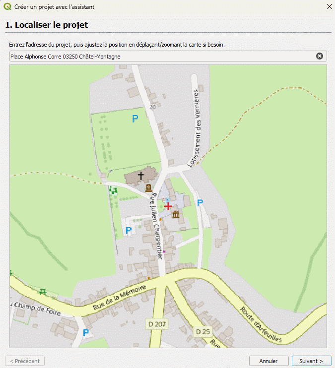
</div>

En **International**, l'adresse est cherchée dans OpenStreetMap et le système
de coordonnées proposé est la zone UTM de l'adresse — ici Dakar, EPSG:32628 —,
remplaçable par un système national en mètres. Il est contrôlé avant de passer
à l'étape suivante.

<div align="center">
  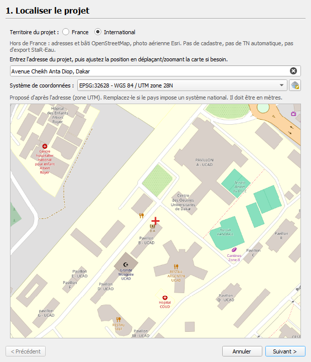
</div>

**2. Fonds de plan** — choix des fonds à charger dans le nouveau projet (OSM
désaturé et Orthophoto IGN cochés par défaut, BAN / Noms de voie / PCI Bâti /
PCI Parcelles en option).

<div align="center">
  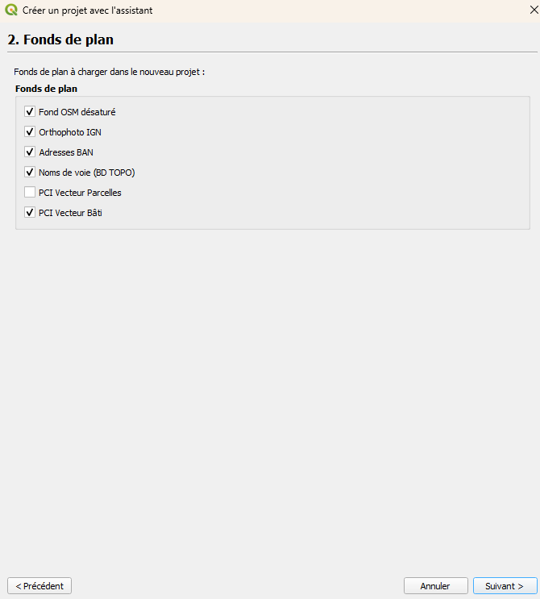
</div>

En International, trois fonds : OpenStreetMap, photo aérienne Esri World
Imagery et bâti OpenStreetMap, coché d'office puisque les branchements
automatiques en ont besoin.

<div align="center">
  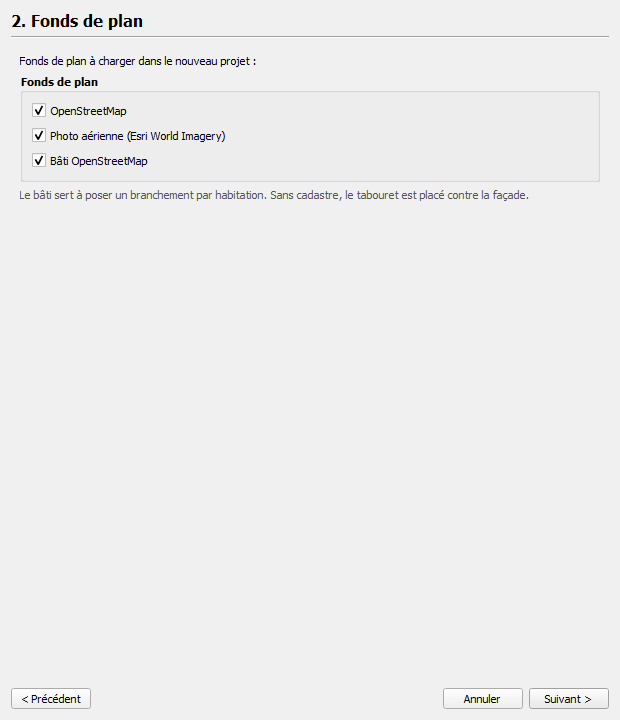
</div>

**3. Configuration rapide** — trois accordéons repliables (mêmes réglages que
le dialogue *Configuration rapide*), avec aperçu schématique et cadres
colorés par réseau (EU rouge, EP bleu) pour s'y retrouver d'un coup d'œil :

- *Réseau par défaut* — diamètre et matériau des conduites et branchements EU/EP.

  <div align="center">
    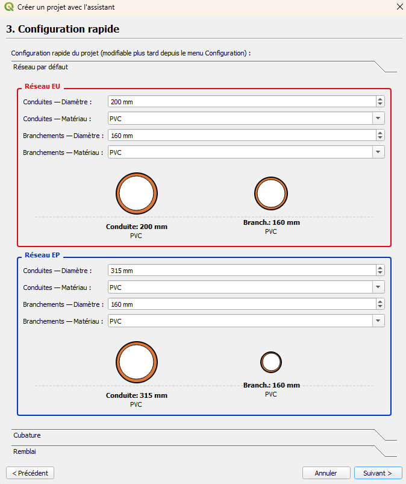
  </div>

- *Cubature* — épaisseur du lit de pose et largeurs de tranchée, avec aperçu
  visuel de la coupe pour la sélection courante.

  <div align="center">
    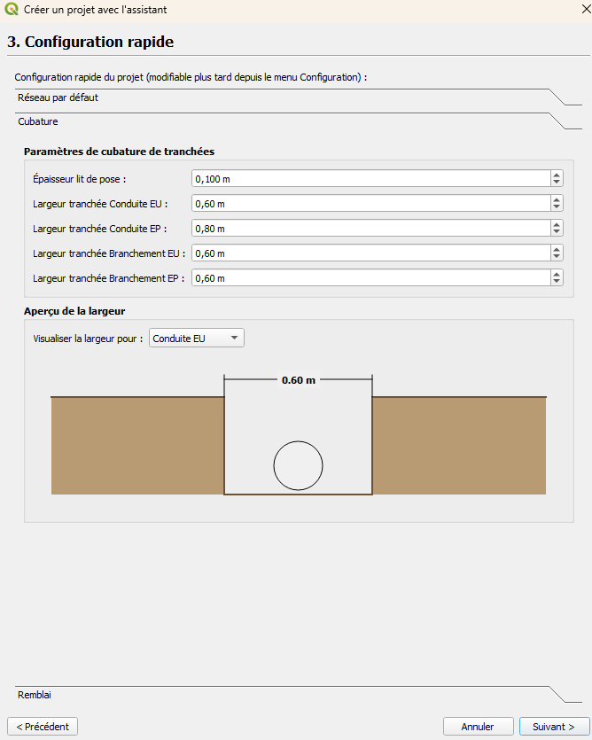
  </div>

- *Remblai* — matériaux et épaisseurs (lit de pose, enrobage, remblai,
  chaussées inférieure/supérieure), avec schéma de coupe mis à jour en direct.

  <div align="center">
    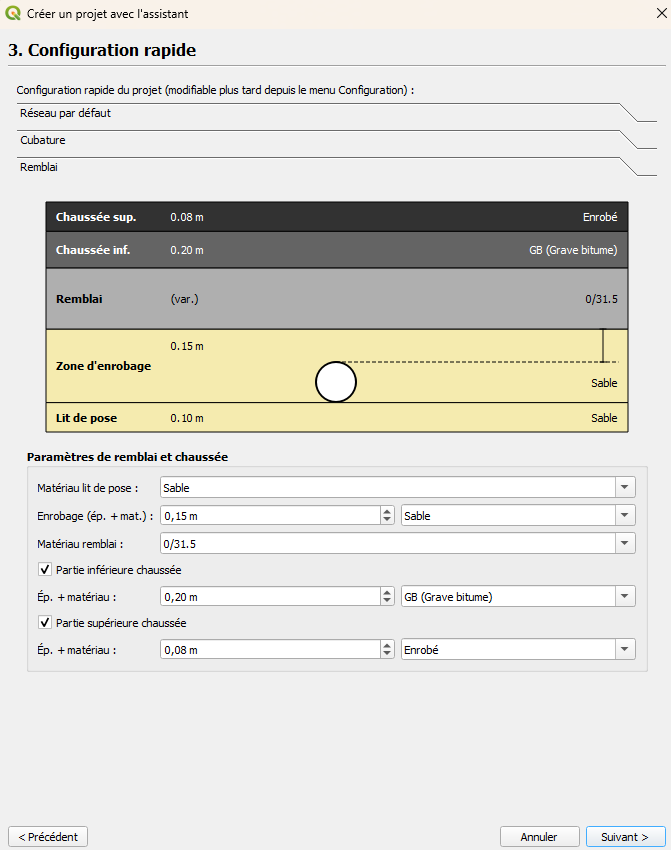
  </div>

**4. Récapitulatif** — nom du projet et dossier d'enregistrement, puis relecture
visuelle de tous les choix (réseau, largeurs de tranchée par cadre EU/EP,
coupe de remblai) avant de cliquer sur « Créer ».

<div align="center">
  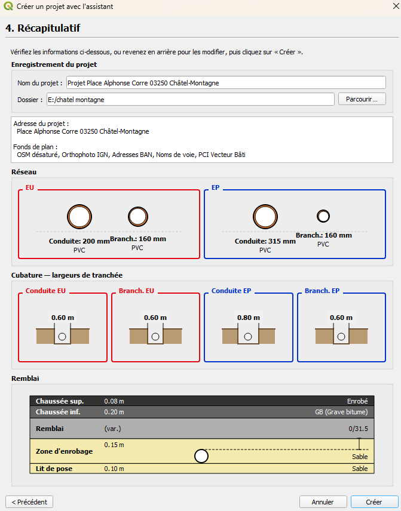
</div>

#### 🌍 Exemple international — Dakar

Collecteur EU PVC 200 rue de Fatick, quartier Point E (Dakar, Sénégal), joué
entièrement par script : projet International en UTM 28N (EPSG:32628, écart de
longueur **0,047 %** au chantier), bâti OpenStreetMap, collecteur posé sur
l'axe OSM de la rue — 8 regards, 311 m — et un branchement par bâtiment
riverain, piqué au milieu de son front de rue.

```python
api.nouveau_projet(adresse="Rue de Kaolack, Dakar", territoire="international")
api.attendre_fonds(["OSM - Bati"])
axe = api.axe_de_rue("Rue de Fatick", commune="Dakar")
api.tracer_conduite("EU", axe=axe, entraxe_max=50, diametre=200, materiau="PVC")
api.creer_branchements("EU", distance_max=15, diametre=160, materiau="PVC")
```

<div align="center">
  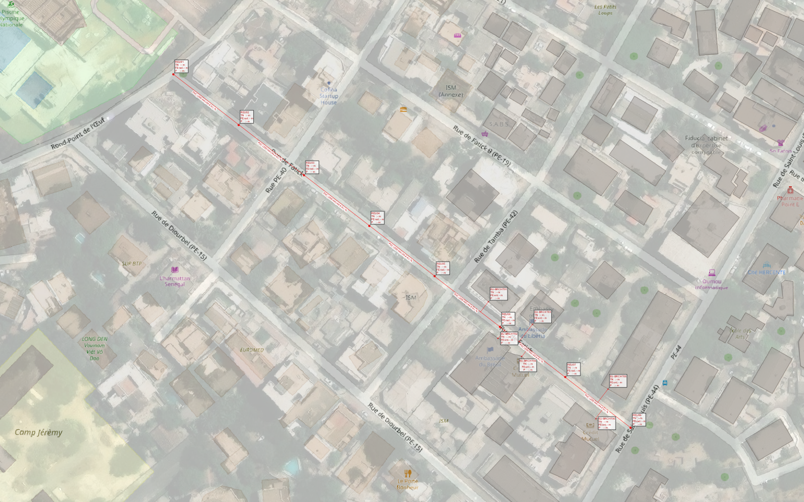
</div>

#### ✏️ Dessin de réseau

Dessin d'une conduite EU par clics successifs — chaque sommet génère
automatiquement un regard ; l'info-bulle en direct affiche longueur, gisement
et pente du tronçon en cours de tracé.

<div align="center">
  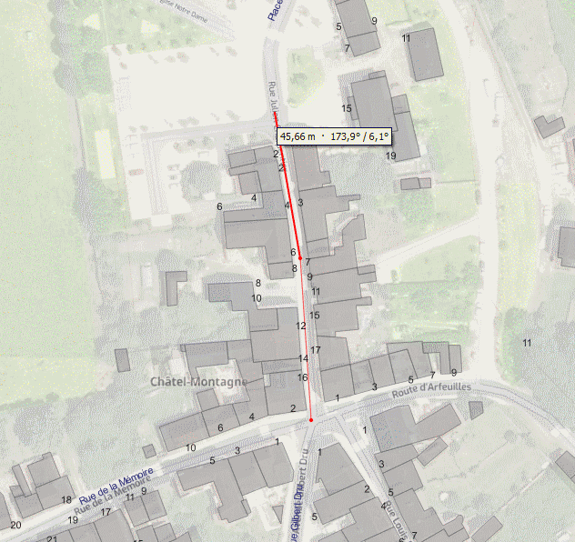
</div>

Dessin d'un branchement par piquage sur une conduite existante, jusqu'à
l'ouvrage terminal (regard ou tabouret).

<div align="center">
  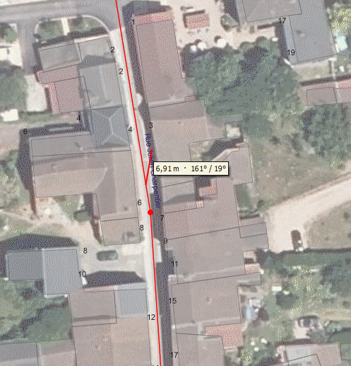
</div>

#### 🔢 Renumérotation

Renumérote en série les regards et tabourets d'un réseau à partir d'un
préfixe et d'un numéro de départ (ex. `REU00`, `REU01…` / `EU-BRCHT01…`).

<div align="center">
  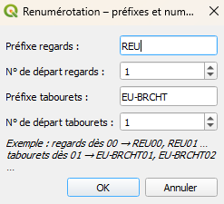
</div>

#### 📋 Tableau de saisie — pente

Saisie groupée en tableau, par onglets **Regards**, **Tabourets**,
**Conduites**, **Branchements** et **Chaîne regards PENTE** — avec calcul
automatique de la pente ou de la cote fil d'eau, aperçu carte miniature et
annulation (Ctrl+Z).

<div align="center">
  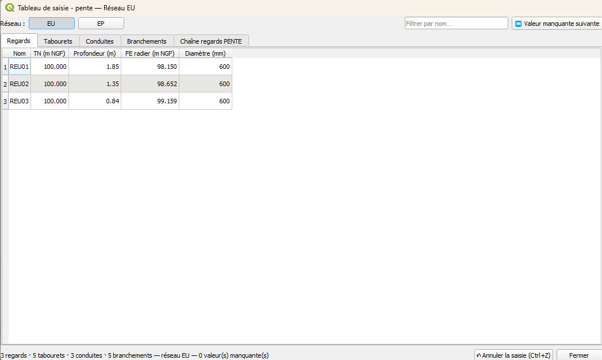
</div>

<div align="center">
  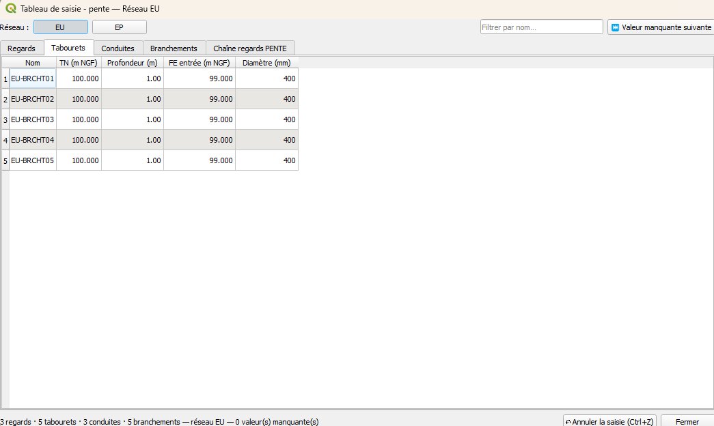
</div>

<div align="center">
  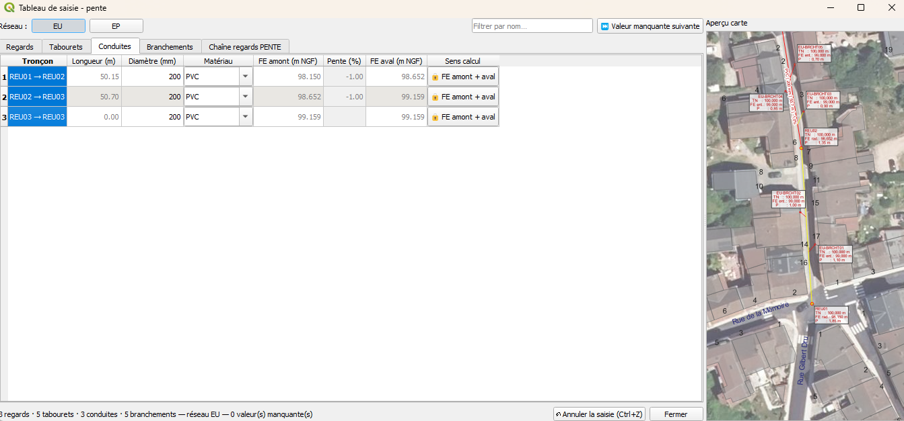
</div>

<div align="center">
  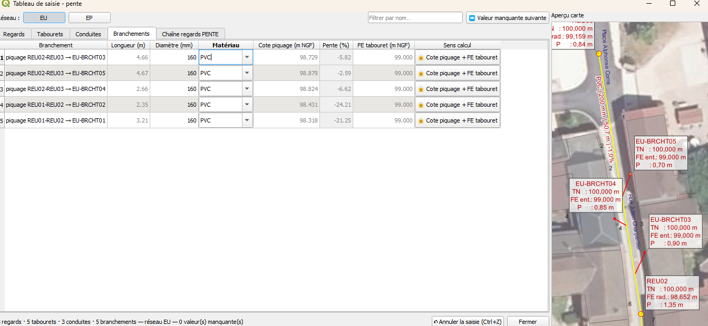
</div>

L'onglet **Chaîne regards PENTE** trace le profil simplifié entre deux
regards choisis et permet d'appliquer une pente constante, une pente
calculée ou une profondeur fixe sur toute la chaîne d'un coup.

En AEP, les **compteurs** figurent aussi dans les listes de départ et
d'arrivée (marqués « (Compteur) ») : la chaîne rejoint le compteur par son
branchement, et coupe la conduite au droit du robinet de branchement, posé
dessus sans la couper, au prorata de sa longueur. TN, profondeur et fil
d'eau du compteur se règlent alors comme ceux d'un nœud.

<div align="center">
  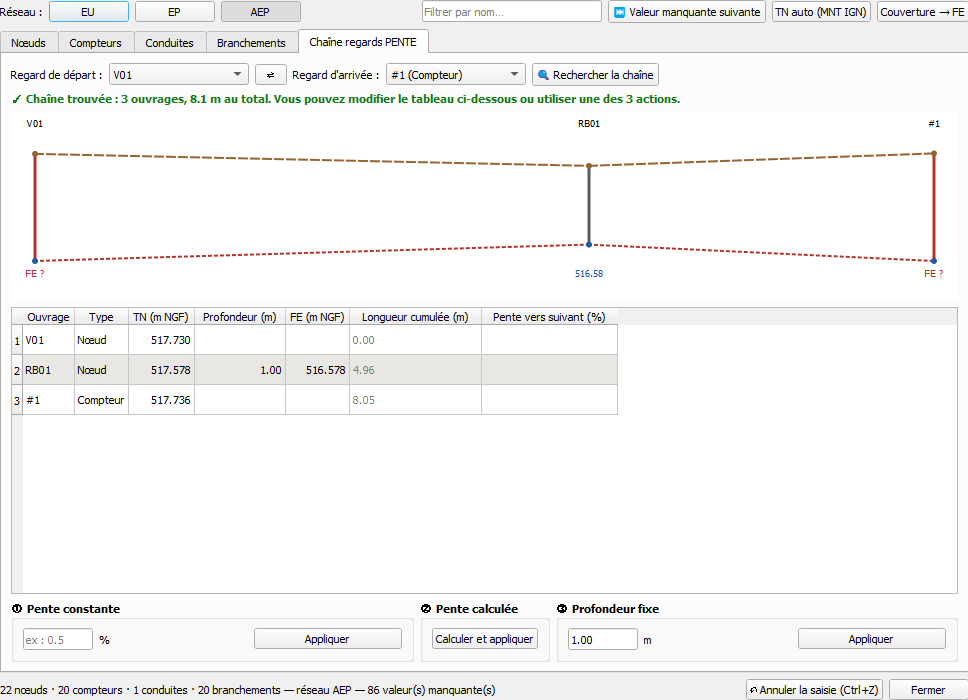
</div>

<div align="center">
  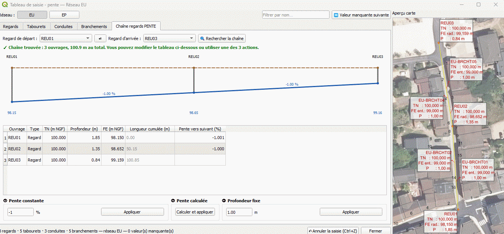
</div>

#### 🛰️ TN auto (MNT IGN)

Bouton du Tableau de saisie qui relève le terrain naturel sur le MNT LiDAR HD
(repli RGE ALTI), et propose les valeurs dans un dialogue d'aperçu avant
écriture : TN actuel, TN proposé, écart et source, ligne par ligne — rien
n'est appliqué sans validation.

<div align="center">
  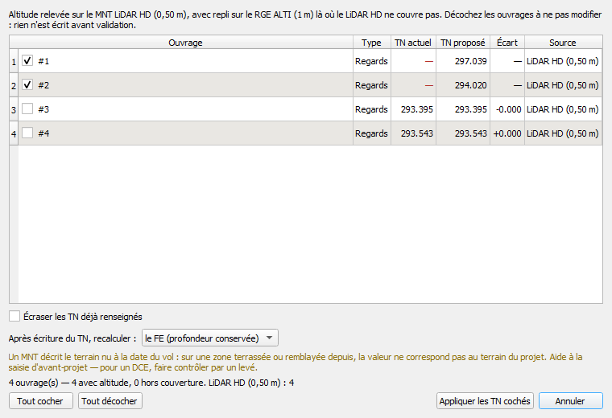
</div>

#### 📈 Profil en long

Options avant tracé (tableau de valeurs, flèches et noms de piquage,
distance de piquage, format papier), puis le profil généré : altitude du
terrain naturel, fil d'eau, piquages des branchements, tableau de valeurs
sous le graphique.

<div align="center">
  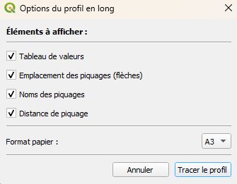
</div>

<div align="center">
  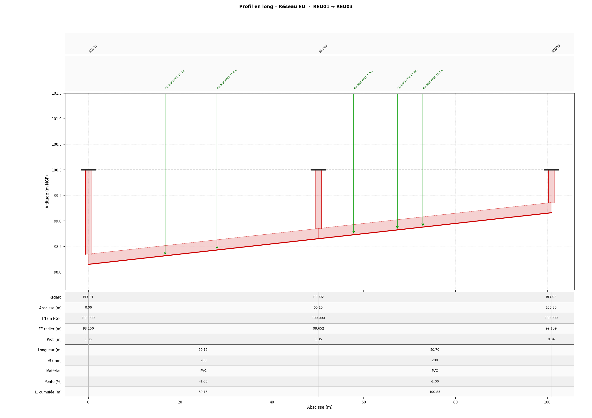
</div>

#### ✂️ Coupe transversale

Coupe verticale de tranchée sur un tronçon choisi : mini-carte de situation
à gauche, coupe cotée à droite (chaussées, remblai, enrobage, lit de pose,
diamètre de la conduite), export PDF ou PNG au format et à l'échelle choisis.

<div align="center">
  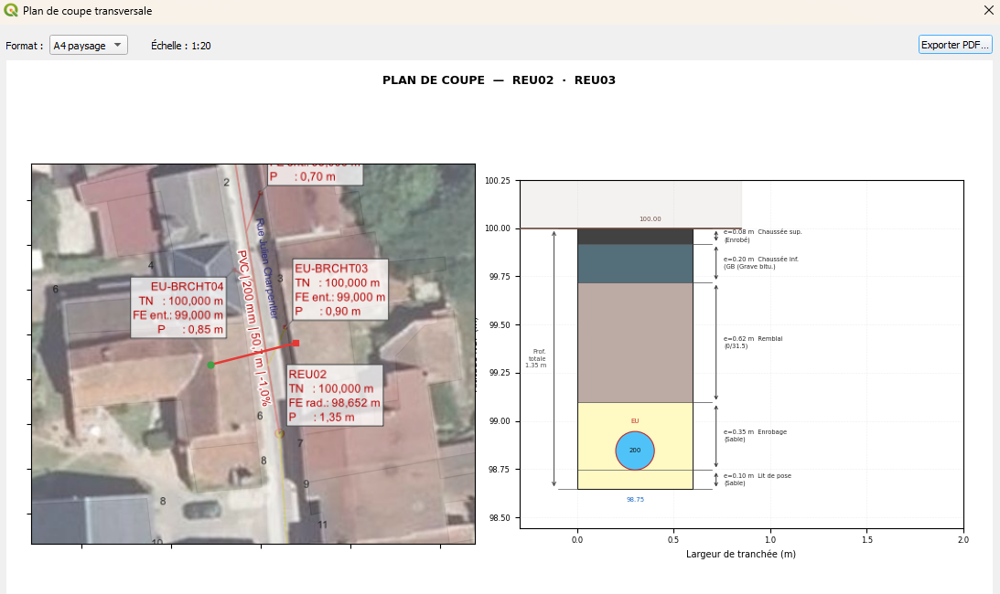
</div>

#### 🚧 Cubature et remblai

Options de calcul (périmètre tout le projet / EU seul / EP seul, conduites
et/ou branchements, sélection par parcours BFS entre deux regards ou par
tracé d'un axe) puis résultats détaillés par tronçon : longueur, pente,
volumes de lit de pose, enrobage, conduite, chaussées et remblai, avec
sous-totaux et export CSV / PDF / Excel.

<div align="center">
  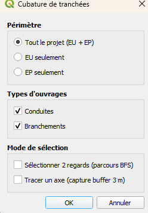
</div>

<div align="center">
  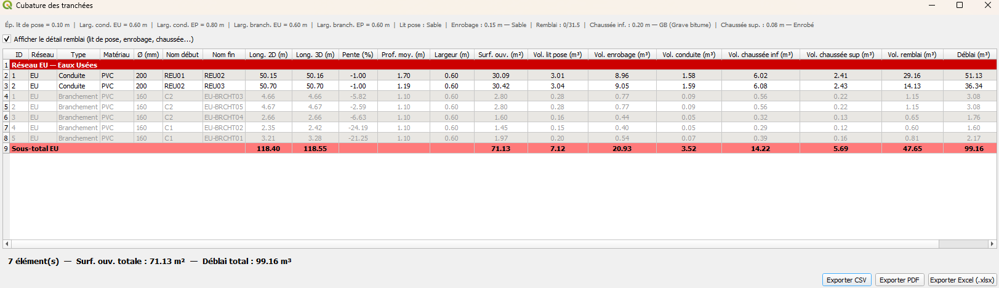
</div>

#### 🖨️ Impression et export PDF / DXF

Une seule fenêtre rassemble ce qu'on veut produire et la façon dont le plan
s'imprime : plus aucune boîte de dialogue intermédiaire entre la validation et
le PDF.

**Ce qu'on exporte** — plan PDF, plan DXF, profils en long EU / EP / AEP /
groupé, cubature (réseaux EU / EP / AEP à cocher, contenu, PDF / XLSX / CSV),
coupes types EU / EP / AEP et, si le projet en a, les **schémas de nœuds AEP**
([SchemAEP](#-schemaep--schémas-de-nœuds-aep)), le tout dans un dossier choisi.
La fenêtre tient sur un écran portable (titre de section et options sur une
même ligne) et les cases propres à un réseau portent sa couleur (EU rouge,
EP bleu, AEP turquoise).

**Comment le plan s'imprime** — format, orientation, échelle et résolution,
en listes déroulantes à la suite de la case *Plan PDF* ; titre du plan
(par défaut **le nom du projet**) et **indice de révision** à côté de la case
*Plan DXF*. Résolution **150 dpi** par défaut, quel que soit le format.

**Le cadrage des planches**, au choix :

- **Automatique** *(par défaut)* — on ne donne que le format et l'échelle. Le
  plugin cherche le découpage qui couvre tout le réseau avec **le moins de
  planches possible**, oriente chacune pour coucher la plus grande longueur du
  réseau sur la plus grande dimension de la feuille (axe horizontal médian en
  paysage, vertical en portrait), les numérote **dans l'ordre du terrain** et
  garde le **cartouche du même côté** d'une planche jointive à l'autre, pour
  que les tirages s'assemblent sans en retourner un. La marge réservée autour
  du réseau se déduit des **étiquettes réellement affichées** — leur texte est
  évalué — afin qu'aucune ne soit coupée. À échelle large, quand tout tient
  sur une planche, celle-ci est centrée sur le réseau, nord en haut.
  Le nord reste toujours dans la moitié haute de la feuille (plus de planche
  tête en bas), les planches sont **réparties régulièrement** le long du
  réseau et les planches superflues retirées ; secteur par secteur, un
  quadrillage nord en haut remplace le découpage s'il économise une planche.
- **Pose manuelle** — placement des planches à la souris, clic pour ancrer,
  clic pour orienter, clic droit pour lancer l'export. `Échap` rouvre les
  réglages sans perdre les planches déjà posées.

**Le plan d'ensemble** *(case cochée par défaut)* ouvre le dossier : chaque
planche y apparaît avec **sa propre teinte** et son numéro cerné de blanc, et
son cadre délimite exactement la zone que montrera la planche.

**Le cartouche** rassemble tout ce qui n'est pas la carte, qui n'est plus
masquée par la barre d'échelle ni la flèche du nord :

| Titre | Échelle | Nord | Réseaux | Références | Date | Planche |
|---|---|---|---|---|---|---|
| titre du plan, « Plan de réseau EU · AEP » | format et échelle, barre graduée | orienté selon la planche | trait de couleur par réseau présent | RGF93 / Lambert-93 (ou système du projet), altitudes NGF-IGN69 en France | date, indice | n / N et **mini-plan de situation** (planche courante en couleur) |

<div align="center">
  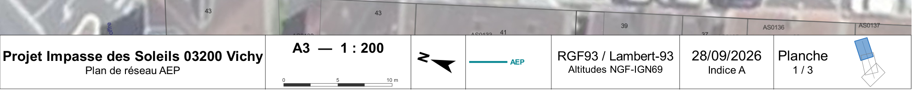
</div>

**Fonds de plan lents ou indisponibles** — pendant l'impression, une image
de fond (Ortho IGN, OSM…) n'est attendue que 20 s. Si un serveur ne répond
pas, les planches concernées sont retentées une fois automatiquement ; si le
fond manque encore, CanaPlan le dit et propose d'**imprimer sans ce fond**,
de **réessayer dans 2 minutes** (serveur moins chargé) ou d'imprimer tel quel.
La fenêtre de progression détaille chaque carte (prête en x s / en cours) et
les images de fond encore attendues, serveur par serveur.

<div align="center">
  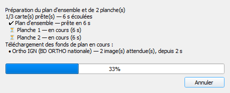
</div>

**Fenêtre de suivi de l'export** — toutes les sorties possibles, demandées ou
non, avec leur état (à faire, en cours, posez les planches, fait, erreur,
abandonné) et le temps mesuré de chacune ; elle reste ouverte à la fin avec
« Ouvrir le dossier ». Les comptes rendus ne demandent plus de cliquer sur
*OK* : un bandeau dans la barre de messages propose d'ouvrir le dossier, et
le DXF ne s'ouvre plus tout seul.

<div align="center">
  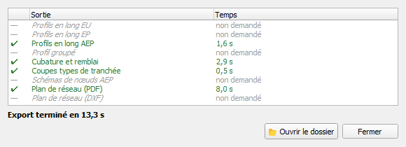
</div>

> **Toutes les pièces (ZIP)** — le bouton rouge, en haut à droite de la
> fenêtre, produit d'un coup le plan PDF et DXF, les profils EU et EP, la
> cubature remblai (PDF + XLSX) et les coupes types EU et EP, rassemblés dans
> une seule archive. Les cases cochées sont ignorées : c'est un raccourci
> « tout le dossier », pas une option de plus.
>
> **PDF complet** — le bouton violet, à sa gauche, prend le même contenu et
> l'assemble en **un seul document** : plan, puis profils EU/EP, puis coupes
> types, puis schémas de nœuds AEP, puis cubature. Le DXF et le classeur XLSX ne sont pas produits, ils ne
> s'assemblent pas dans un PDF. À choisir selon l'usage : l'archive garde les
> pièces séparées et rééditables, le PDF se fait circuler tel quel.
> L'assemblage repose sur *pypdf*, vérifié **avant** de produire quoi que ce
> soit — jamais après avoir fait poser les feuilles du plan. Le compte rendu
> final, dans les deux cas, propose d'ouvrir le dossier de sortie.

<div align="center">
  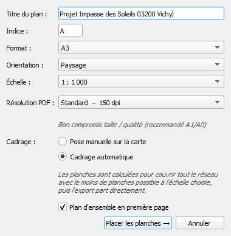
</div>

<div align="center">
  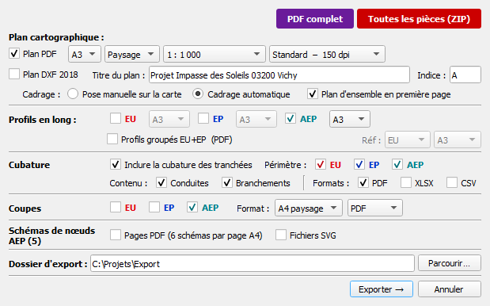
</div>

<div align="center">
  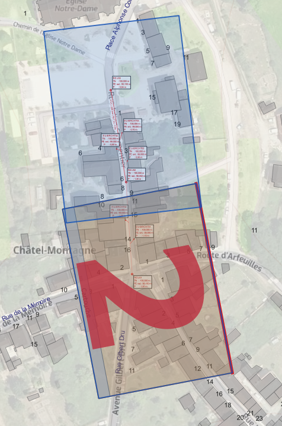
</div>

<div align="center">
  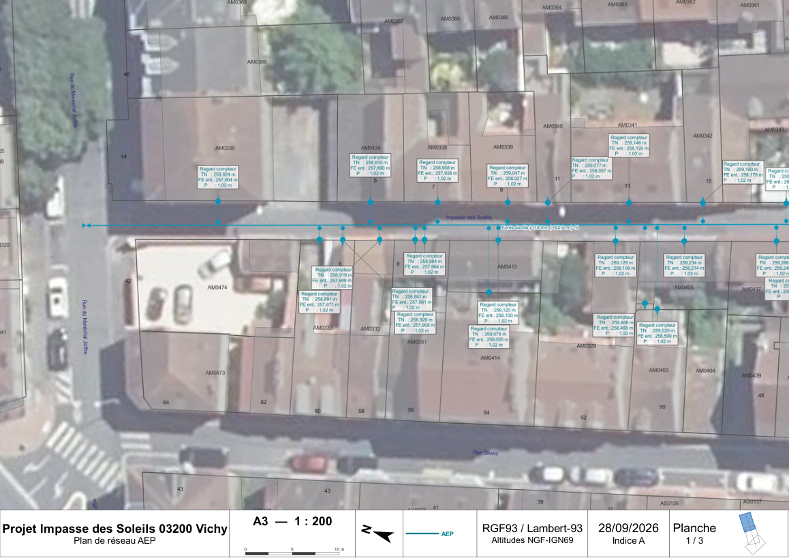
</div>

### 🗺️ Fonds de plan

| Outil | Description |
|---|---|
| **Mise en place fond de projet** | France : charge les 6 fonds de carte (BAN, Noms de rue, PCI Bati, PCI Parcelles, OSM Desature, Ortho IGN) sur l'emprise courante et configure le projet (fond blanc, SCR). International : OpenStreetMap, photo aerienne Esri et bati OpenStreetMap. |
| **BAN Adresses (vecteur)** | Charge les adresses de la BAN sur l'emprise courante. |
| **Noms de rue BD TOPO** | Charge les voies nominees de la BD TOPO sur l'emprise courante. |
| **PCI Vecteur Parcelles** | Charge les parcelles cadastrales (Parcellaire Express IGN) sur l'emprise courante. |
| **PCI Vecteur Bati** | Charge les batiments (BD TOPO) sur l'emprise courante. |
| **Ortho IGN (BD ORTHO nationale)** | Ajoute le flux d'orthophotographie BD ORTHO de l'IGN, disponible sur toute la France (remplace l'ancien fond regional CRAIG limite a un millesime). |
| **OSM Desature** | Ajoute un fond OpenStreetMap desature. |
| **OpenStreetMap (monde)** | Fond OpenStreetMap standard, disponible partout. |
| **Photo aerienne Esri (monde)** | Esri World Imagery, affichee a l'echelle du chantier. |
| **Bati OpenStreetMap (monde)** | Batiments OSM (Overpass) sur l'emprise de la carte, ecrits dans le systeme du projet : c'est le bati des branchements automatiques hors de France. |

Le menu *Fond de plan* est decoupe en deux sections, **France** et
**International**. La section International est proposee dans tous les
projets ; dans un projet International, la section France (IGN, BAN, cadastre)
est masquee, comme l'import Star-DT et l'export StaR-Eau. Les mentions de
source d'OpenStreetMap et d'Esri sont imprimees sur les plans PDF qui montrent
ces fonds.

---

## 💧 Réseau AEP — eau potable

Depuis la 2.2, CanaPlan dessine les réseaux d'eau potable. L'AEP reprend les
quatre couches d'EU et EP, avec le vocabulaire du métier :

| Couche | EU / EP | AEP |
|---|---|---|
| `conduite_AEP` | collecteur | conduite principale |
| `branchement_AEP` | branchement | branchement |
| `regard_AEP` | regard | **nœud** : appareil ou pièce, champ `type` |
| `tabouret_AEP` | tabouret | **compteur** : regard compteur ou extrémité libre |

Le dessin, le déplacement avec recalage, la suppression, les profils et la
cubature fonctionnent donc sans changement : un nœud AEP est un point de la
topologie, comme un regard. Le groupe AEP n'apparaît que dans les projets qui
en ont un : un projet d'assainissement n'en voit rien.

<div align="center">
  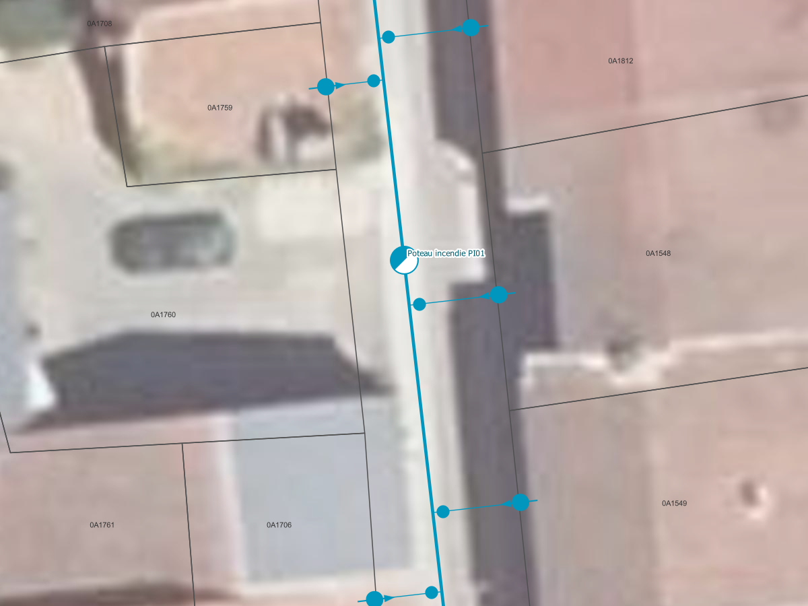
  <br><sub>Conduite Ø 110 fonte, robinets de branchement au piquage, compteurs en limite de parcelle, poteau incendie PI01.</sub>
</div>

### Nœuds et appareils

Chaque sommet de conduite reçoit un nœud, créé en **vanne**. On change son
type avec **Poser un appareil AEP**, **Renseigner** ou le **Tableau de
saisie** ; un nœud sans type se lit comme un coude.

| Type | Préfixe | Dessiné |
|---|---|---|
| Vanne | `V` | oui, dans l'axe de la conduite |
| Robinet de branchement | `RB` | oui, décalé de 0,35 m vers son branchement |
| Ventouse | `VT` | oui |
| Vidange | `VD` | oui, perpendiculaire à la conduite |
| Poteau incendie | `PI` | oui |
| Bouche incendie | `BI` | oui |
| Réducteur de pression | `RP` | oui, dans l'axe de la conduite |
| Compteur de réseau | `CPT` | oui |
| Raccordement sur existant | — | oui (croix), non numéroté |
| Coude, té, réduction, bouchon | — | non : un point discret plus près que le 1/150 |

Le **robinet de branchement** est posé par l'outil branchement, au point de
piquage, sans couper la conduite. Il suit son branchement quand on déplace
le piquage, la conduite ou le nœud, et disparaît avec lui.

<div align="center">
  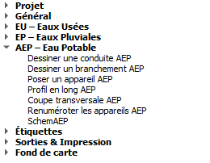
  &nbsp;&nbsp;
  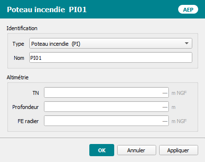
</div>

### Symboles StaR-Eau

Les symboles sont ceux de la collection `eau_potable` du géostandard
**StaR-Eau** ([github.com/cnigfr/StaR-Eau](https://github.com/cnigfr/StaR-Eau)),
embarqués dans `icon/stareau_aep/` et teintés à la couleur du réseau (cyan).
Leurs tailles sont en mètres : l'emprise au sol ne dépend pas du zoom, et le
plan au 1/200 garde les proportions de l'écran. Les **bouches à clé** se
superposent aux vannes et robinets par une option de la Configuration rapide,
sans créer d'objet.

<div align="center">
  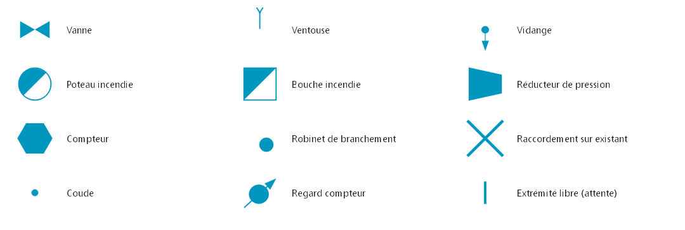
</div>

> Sources : ASTEE, CNIG, Grand Lyon — dépôt StaR-Eau sous **Licence Ouverte
> Etalab 2.0** (copie jointe dans `icon/stareau_aep/LICENCE_ETALAB_V2.md`) ;
> les métadonnées des fichiers SVG mentionnent **CC BY-SA 4.0**.

### Altimétrie : la couverture

Un réseau sous pression n'a pas de pente imposée. Le fil d'eau des nœuds et
des compteurs se déduit du terrain naturel et de la **couverture** (1,00 m par
défaut, Configuration rapide) :

```
fil d'eau = TN − couverture − DN / 1000        profondeur = TN − fil d'eau
```

Le bouton **Couverture → FE** du Tableau de saisie applique ce calcul à tout
le réseau AEP en une seule opération (Ctrl+Z annule le lot). Le DN d'un nœud
est celui du plus gros tronçon qui y arrive ; celui d'un compteur, celui de son
branchement. Le **TN auto (MNT IGN)** fonctionne aussi sur l'AEP.

<div align="center">
  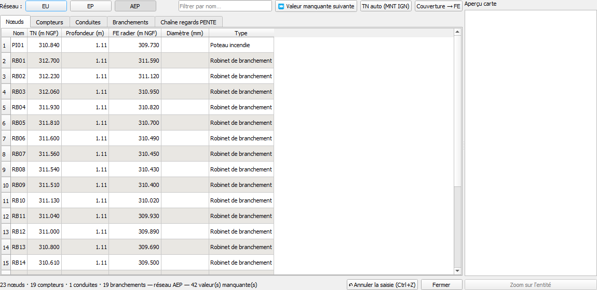
</div>

### Profils, coupes et cubature

Le profil en long AEP ne dessine pas de cheminée : chaque appareil porte un
repère (tige de manœuvre du TN à la génératrice supérieure), et les nœuds
muets ne figurent ni sur le graphique ni dans le cartouche. Le profil groupé
superpose EU, EP et AEP, chaque réseau avec sa propre table de nœuds. La
coupe transversale déduit le fil d'eau manquant de la couverture ; la
cubature a ses largeurs de tranchée AEP (0,60 m conduite, 0,40 m branchement
par défaut).

<div align="center">
  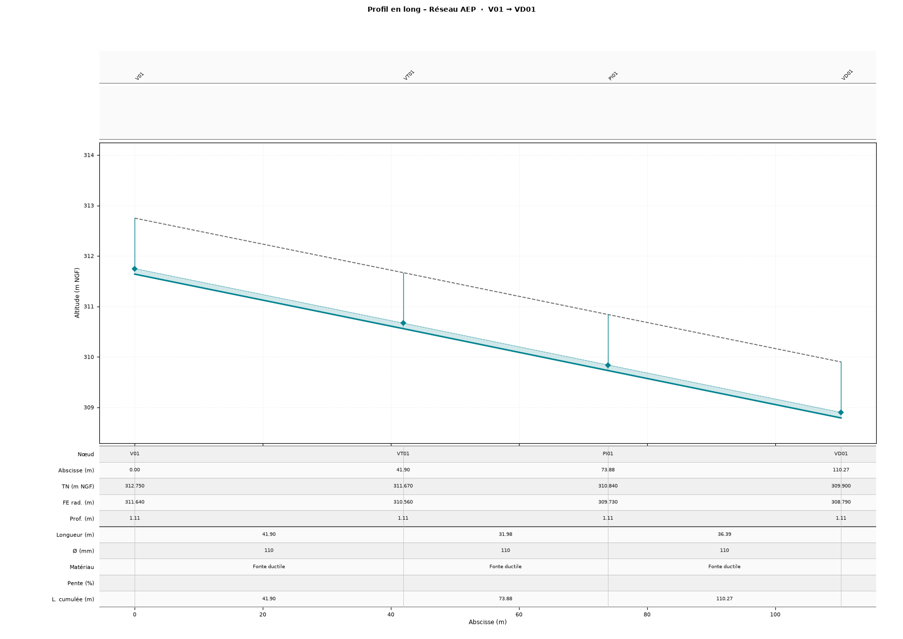
</div>

### Export StaR-Eau « EAU »

Le type de fichier **EAU** de l'export StaR-Eau écrit les tables `aep_*` ;
**ASS** reste l'assainissement. Un projet qui ne porte que de l'AEP passe
directement en EAU.

| CanaPlan | Table StaR-Eau |
|---|---|
| Conduite AEP | `aep_canalisation` (cotes de génératrice supérieure = fil d'eau + DN) |
| Branchement AEP | `aep_canalisation_branchement` |
| Vanne | `aep_vanne` |
| Ventouse, vidange | `aep_appareillage` |
| Réducteur de pression | `aep_regulation` |
| Compteur de réseau | `aep_point_mesure` |
| Poteau / bouche incendie | `aep_point_livraison` de type `incendie`, `PI` / `BI` en `ref_externe` |
| Coude, té, réduction, bouchon, raccordement | `aep_piece` |
| Robinet de branchement | `aep_raccord` (non sécant, rattaché à sa conduite) |
| Compteur (bout de branchement) | `aep_point_livraison` |

Un cadre **Eau potable** de l'onglet Contenu fixe fonction et contenu de la
canalisation, type de pression, type et fonction des vannes, sens de
fermeture et type de point de livraison.

### Pilotage par script

```python
from qgis.core import QgsPointXY
from CanaPlan.tools import api
api.tracer_conduite("AEP", points=[QgsPointXY(727000, 6560000), QgsPointXY(727080, 6560010)],
                    diametre=110, materiau="Fonte ductile")
api.branchements_auto("AEP", mode="parcelle")             # Magic Box : un branchement par parcelle riveraine
api.appareil_aep([727040, 6560005], "poteau_incendie")   # nœud existant retypé, ou inséré sur la conduite
api.couverture_aep(1.0)                                  # fil d'eau = TN − couverture − DN
api.renumeroter("AEP")                                   # V01…, PI01…, RB01…
api.controle_stareau(type_fichier="EAU")
```

Voir [API.md](API.md).

---

## 📐 SchemAEP — schémas de nœuds AEP

**SchemAEP** dessine le schéma de pièces d'un nœud du réseau d'eau potable :
tés, vannes, brides, emboîtements, cônes, prises en charge, poteaux… avec la
symbologie AEP (emboîtement en demi-cercle, bride en trait, Express,
électrosoudable, filetages, joint verrouillé). C'est le portage dans QGIS de
la page autonome [SchemAEP](https://github.com/Cartoyoyo/SchemAEP) : même
catalogue, mêmes contrôles, même fichier `.json` — un schéma s'ouvre dans
l'une ou l'autre.

**Lancement** — entrée **SchemAEP** du dossier *AEP – Eau Potable* (panneau
latéral et menu). Une liste des nœuds AEP (nom, type, ✔ et date si le nœud a
déjà son schéma) permet de choisir le nœud, avec une recherche, ou de le
**cliquer sur la carte**. Un **schéma libre**, non rattaché à un nœud, reste
possible. Le formulaire **Renseigner** d'un nœud AEP a aussi son bouton
**SchemAEP** (« SchemAEP ✔ » si le nœud a déjà son schéma) : il enregistre le
formulaire et ouvre le schéma du nœud.

**Copier / coller** — un schéma se copie depuis la liste (*Copier le schéma*)
ou depuis l'éditeur (*Copier*), et se colle sur un ou plusieurs nœuds
sélectionnés dans la liste (Ctrl+clic, Maj+clic : *Coller sur la sélection*),
ou dans l'éditeur ouvert (*Coller*, annulable par Ctrl+Z). Chaque copie prend
le nom de son nœud ; un nœud qui a déjà un schéma n'est remplacé qu'après
confirmation. Pratique pour les branchements, souvent identiques d'un nœud à
l'autre.

<div align="center">
  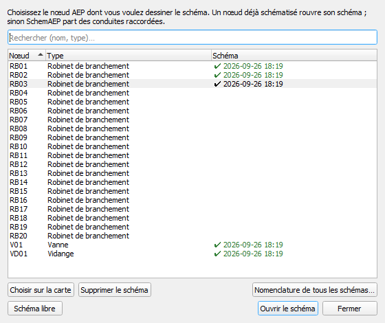
</div>

**Schéma de départ** — un nœud sans schéma n'ouvre pas une page blanche :

- chaque conduite ou branchement qui touche le nœud devient une pièce
  *Réseau existant*, avec son diamètre, son matériau et **sa direction sur la
  carte**, repérée par le nœud voisin (« vers V02 », « vers Coude #5 ») ;
  une conduite qui passe sous un robinet de branchement sans être coupée
  compte pour deux directions ;
- l'appareil du type du nœud est posé au centre, orienté et raccordé :
  robinet-vanne, té, coude (angle le plus proche de celui des conduites),
  cône, bouchon, prise en charge, compteur, ou le montage type de la
  ventouse, de la vidange, du poteau ou de la bouche d'incendie et du
  réducteur de pression. En bout de branche, le té de piquage du montage
  est retiré.

<div align="center">
  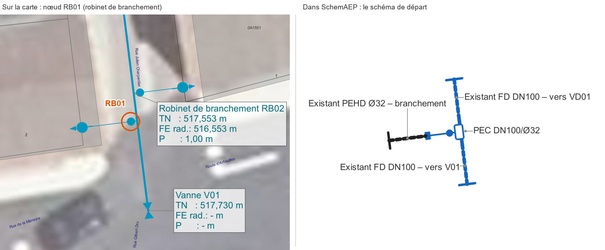
  <br><sub>Le robinet de branchement RB01 : la conduite Ø 110 fonte qui le traverse devient deux pièces existantes (vers VD01, vers V01), le branchement PE Ø 32 part à l'ouest comme sur la carte, la prise en charge est posée au centre.</sub>
</div>

**L'éditeur** — fenêtre indépendante, QGIS reste utilisable à côté :

- **palette** de 64 pièces en 9 familles, recherche sans accents, aperçus ;
- **raccordement** : clic sur un point orange (extrémité libre), puis sur une
  pièce — elle arrive avec le même diamètre et matériau, et le point suivant
  est sélectionné pour enchaîner ; glisser une pièce déplace l'ensemble
  raccordé avec **aimantation** sur l'extrémité libre la plus proche (Alt :
  pièce seule, Maj : sans grille) ;
- **extrémités au choix** point par point (bride, emboîtement, Express, bout
  uni, électrosoudable, compression, filetages, verrouillé) : la variante du
  catalogue si elle existe, sinon le type imposé sur ce seul point ;
- **contrôle des assemblages** : un rond rouge sur chaque liaison impossible,
  avec la pièce d'adaptation à prévoir (bride-emboîtement, bride-bout uni,
  cône, raccord universel…) ; un défaut accepté se **valide** ;
- **nomenclature** automatique (butées béton, bouches à clé, regards compris) ;
- **étiquettes** sans chevauchement, déplaçables (double-clic : retour au
  placement automatique) ;
- **favoris** : les montages types (poteau et bouche d'incendie, branchements,
  purge, réducteur, ventouse, vidange) et vos propres montages ou schémas ;
- rotation de tout le schéma, **Effacer tout**, annulation (Ctrl+Z) ;
- sorties : **SVG**, nomenclature **CSV**, **impression** (schéma + nomenclature).

<div align="center">
  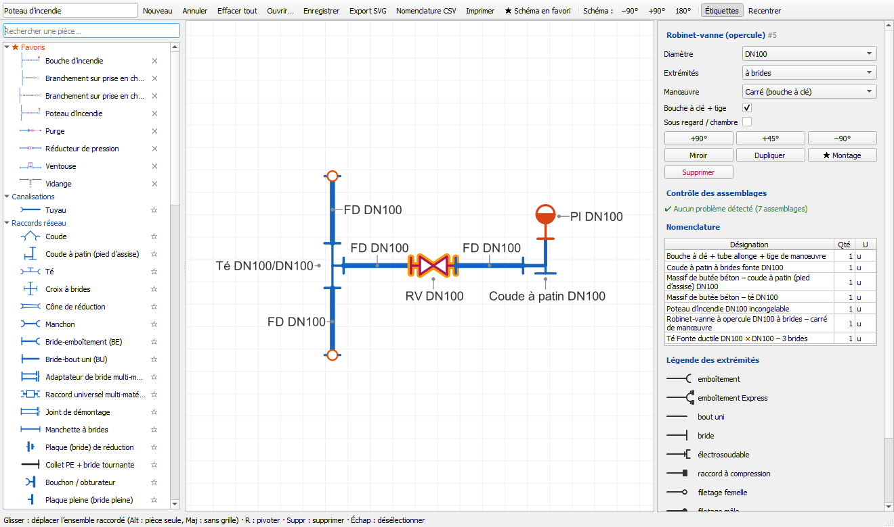
  <br><sub>Montage type « Poteau d'incendie » : té à brides, robinet-vanne sélectionné, coude à patin, poteau — contrôle des assemblages et nomenclature à droite.</sub>
</div>

<div align="center">
  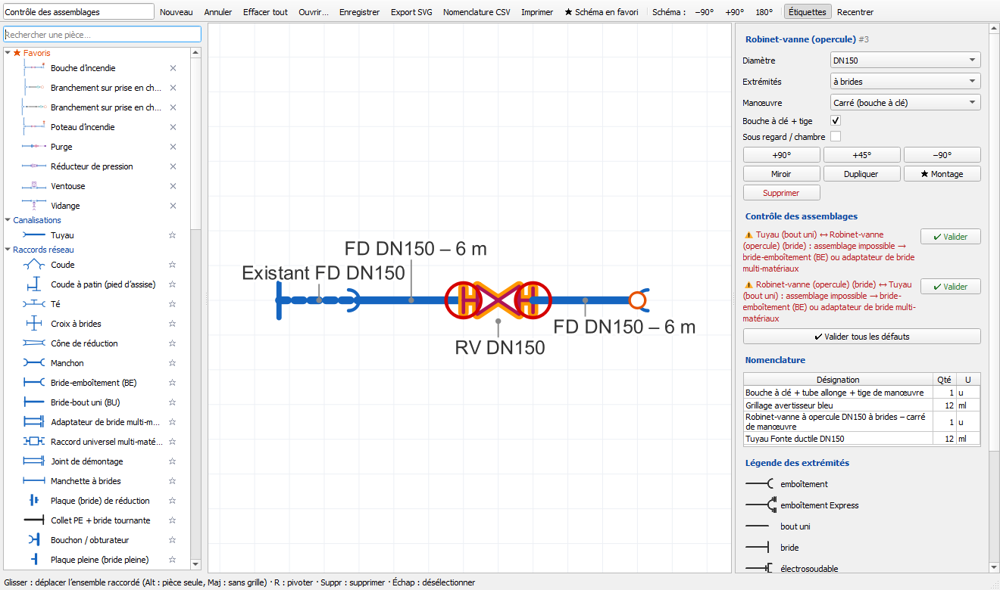
  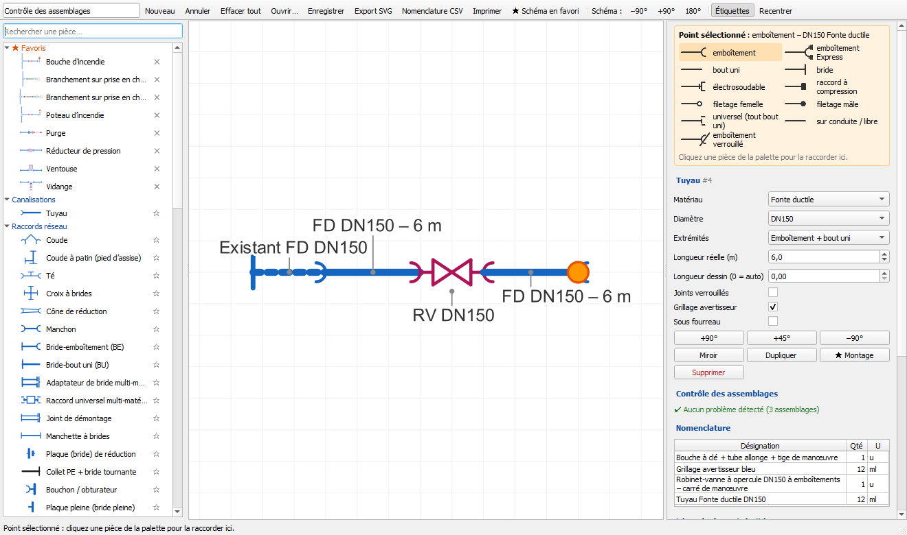
  <br><sub>À gauche, une vanne à brides montée entre deux bouts unis : ronds rouges, pièce d'adaptation proposée, validation. À droite, un point sélectionné et les onze types d'extrémité au choix.</sub>
</div>

**Rangé sur le nœud** — *Enregistrer dans le projet* range le schéma (source
JSON éditable + rendu SVG) sur son nœud ; SchemAEP le propose aussi quand on
change de nœud ou qu'on ferme la fenêtre après une modification. Les schémas
partent dans le `.bet` (table `schema_aep` de `data.gpkg`) et se rattachent à
leur nœud à l'ouverture par son nom et sa position — les identifiants internes
changent à chaque enregistrement. Un nœud renommé ou légèrement déplacé
(moins d'1 m) garde son schéma ; au-delà, le schéma est gardé de côté et
réécrit, jamais perdu.

**À l'export** — la fenêtre d'export propose, dès que le projet a des schémas
de nœuds :

- **Pages PDF** : 6 schémas par page A4, puis la nomenclature de chaque nœud
  (`schemas_aep.pdf`, placé après les coupes types dans le PDF complet) ;
- **Fichiers SVG** : un par nœud, dans le sous-dossier `schemas_aep`.

<div align="center">
  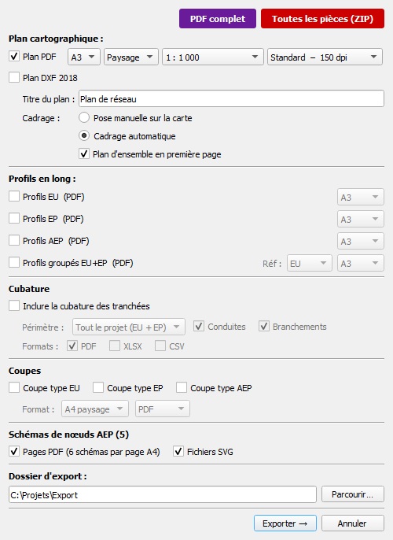
  &nbsp;&nbsp;
  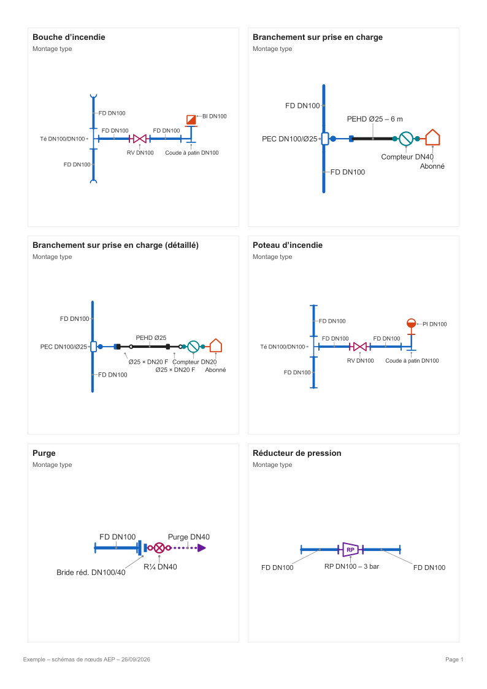
  <br><sub>Les options d'export, et une page A4 de six schémas (ici les montages types des favoris).</sub>
</div>

**Nomenclature du chantier** — le bouton *Nomenclature de tous les schémas…*
de la liste des nœuds additionne les pièces de tous les schémas, avec pour
chaque ligne les nœuds concernés, et l'exporte en CSV.

---

## 🪄 Magic Box

Nouvelle entrée du groupe **Général** : des fonctions automatiques, lancées
à coups de tuiles. La première trace des **branchements automatiques** sur
des tronçons choisis à la souris, pour tous les réseaux (EU, EP, AEP) :

1. **Quoi ?** — un branchement par **parcelle** riveraine (même non bâtie),
   par **bâtiment** ou par **numéro de rue** (adresses BAN) ;
2. **Quel côté ?** — les deux côtés de la rue, ou seulement la gauche ou la
   droite ;
3. clic sur les tronçons, clic droit ou Entrée pour valider ;
4. aperçu en pointillés, avec la liste des cibles écartées et leur motif,
   puis **Tracer** ou **Annuler**. La **portée max** (10 m par défaut, jusqu'à
   100 m) se règle dans l'aperçu et **Recalculer** met à jour les propositions
   sans refaire la sélection — pour atteindre un bâti en retrait de la rue.

Le piquage est perpendiculaire à la conduite, au milieu du front de rue de la
cible ; le branchement s'arrête sur la limite de parcelle, où se pose le
tabouret (le compteur en AEP). Une cible déjà raccordée n'est pas touchée.
Le tracé passe par l'outil branchement : tabouret, robinet AEP, contrôle
topologique et attributs sont les mêmes qu'à la main.

Par script : `api.branchements_auto(reseau, conduites=None, mode="parcelle",
cote="deux", apercu=False)` — `apercu=True` rend les propositions sans rien
écrire.

<div align="center">
  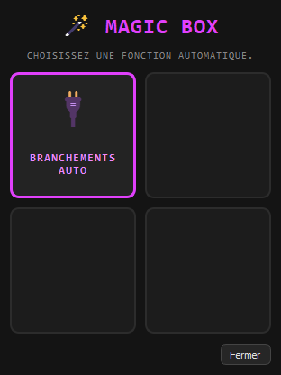
  &nbsp;&nbsp;
  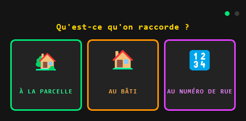
</div>

---

## 🖥️ Interface

Les outils sont accessibles par trois chemins, qui exposent tous les memes
actions :

- la **barre d'outils** « CanaPlan » ;
- le **panneau lateral** (dock), arborescence repliable par categorie ;
- le **menu** *Extensions ▸ CanaPlan*, organise en sous-menus reprenant
  exactement les categories du panneau lateral : Projet, General,
  EU – Eaux Usees, EP – Eaux Pluviales, AEP – Eau Potable, Etiquettes,
  Sorties & Impression, Fond de carte.

En tete du menu, **Afficher la barre d'outils** bascule sa visibilite. La
case est synchronisee nativement par Qt avec l'etat reel de la barre : elle
reste juste meme si l'utilisateur a ferme la barre par la croix ou par le
menu contextuel de QGIS.

**Onglet Interface** de la configuration rapide : langue du plugin,
**apparence du panneau** (colorée par défaut — un bandeau de couleur par
section, EU / EP / AEP aux couleurs de la carte — ou classique) et **contenu
du panneau** : sections et entrées à afficher ou masquer, et leur ordre
(▲ / ▼, retour à l'ordre par défaut). Les choix sont gardés d'une session à
l'autre. Au survol, l'entrée du panneau passe en gras. La configuration
rapide se redimensionne librement (ascenseurs au besoin).

<div align="center">
  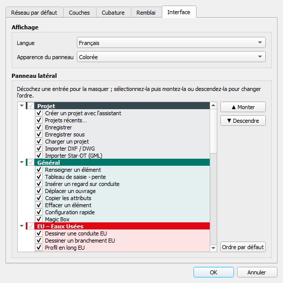
  &nbsp;&nbsp;
  
</div>

En pied de menu, **A propos** ouvre un dialogue qui lit `metadata.txt` :
nom, version, auteur, description, lien vers le depot et vers le profil
LinkedIn de l'auteur. Rien n'y est duplique — la version affichee est
toujours celle du plugin installe.

---

## 🗃️ Couches et attributs

Le plugin gere 4 types de couches, declinees pour chaque reseau (`_EU` / `_EP` / `_AEP`).
Les couches AEP portent en plus `type` (classe du nœud ou du compteur) et
`sym_angle` / `sym_dir` (orientation des symboles, recalculee a chaque
enregistrement) :

### Conduite *(LineString)*
| Champ | Type | Description |
|---|---|---|
| `diametre` | Double | Diametre en mm |
| `materiau` | String | Materiau |
| `longueur` | Double | Longueur en m (calculee automatiquement) |
| `pente` | Double | Pente en % |
| `lbl_x` | Double | X du point d'ancrage de l'etiquette (NULL = placement auto) |
| `lbl_y` | Double | Y du point d'ancrage de l'etiquette (NULL = placement auto) |
| `lbl_rot` | Double | Angle de l'etiquette epinglee en degres (suit l'angle de la ligne au point d'ancrage) |
| `lbl_visible` | Int | Visibilite forcee de l'etiquette (0 = masquee) |

### Branchement *(LineString)*
| Champ | Type | Description |
|---|---|---|
| `id_conduite` | Int | ID de la conduite piquee |
| `pk_debut` | Double | Abscisse curviligne du piquage |
| `cote_piquage` | Double | Cote du piquage en m NGF |
| `diametre` | Double | Diametre en mm |
| `materiau` | String | Materiau |
| `longueur` | Double | Longueur en m |
| `pente` | Double | Pente en % |
| `sens` | String | Sens du branchement |
| `lbl_x` | Double | X du point d'ancrage de l'etiquette (NULL = placement auto) |
| `lbl_y` | Double | Y du point d'ancrage de l'etiquette (NULL = placement auto) |
| `lbl_rot` | Double | Angle de l'etiquette epinglee en degres (suit l'angle de la ligne au point d'ancrage) |
| `lbl_visible` | Int | Visibilite forcee de l'etiquette (0 = masquee) |

### Regard *(Point)*
| Champ | Type | Description |
|---|---|---|
| `nom` | String | Identifiant du regard |
| `tn` | Double | Terrain naturel en m NGF |
| `fe_radier` | Double | Fil d'eau radier en m NGF |
| `diametre` | Double | Diametre en mm |
| `profondeur` | Double | Profondeur en m |
| `lbl_x` | Double | X du point d'ancrage de l'etiquette (NULL = placement auto) |
| `lbl_y` | Double | Y du point d'ancrage de l'etiquette (NULL = placement auto) |
| `lbl_visible` | Int | Visibilite forcee de l'etiquette (0 = masquee) |

### Tabouret *(Point)*
| Champ | Type | Description |
|---|---|---|
| `nom` | String | Identifiant du tabouret |
| `tn` | Double | Terrain naturel en m NGF |
| `fe_entree` | Double | Fil d'eau entree en m NGF |
| `diametre` | Double | Diametre en mm |
| `profondeur` | Double | Profondeur en m |
| `lbl_x` | Double | X du point d'ancrage de l'etiquette (NULL = placement auto) |
| `lbl_y` | Double | Y du point d'ancrage de l'etiquette (NULL = placement auto) |
| `lbl_visible` | Int | Visibilite forcee de l'etiquette (0 = masquee) |

---

## 🎨 Symbologie

Toutes les dimensions sont en **map units (metres)** — la symbologie suit le zoom et reste proportionnelle au plan a 1:200.

- **EU** — Eaux Usees : couleur **rouge**
  - Conduites : largeur data-defined `coalesce("diametre", 200) / 1000` m (epaisseur reelle de la conduite a l'echelle du plan)
  - Branchements : largeur data-defined identique
  - Regards : cercle (1 m de diametre)
  - Tabourets : carre (0.4 m de cote)

- **EP** — Eaux Pluviales : couleur **bleue**
  - Meme logique que EU

- **AEP** — Eau potable : couleur **cyan**
  - Conduites et branchements : meme logique que EU
  - Nœuds et compteurs : symboles StaR-Eau par type (voir [Symboles StaR-Eau](#symboles-star-eau))

Etiquettes : couleur du reseau (rouge EU / bleu EP / cyan AEP ; en AEP, classe et nom sur une ligne : « Vanne V01 », coudes sans etiquette, robinets en option), halo blanc 0.8 mm pour les conduites / branchements, fond rectangulaire blanc + cadre + ligne de rappel pour regards / tabourets.

---

## ⌨️ Raccourcis clavier

<details>
<summary>Voir tous les raccourcis par outil</summary>

### Outils de dessin (conduite, branchement)

| Touche | Action |
|---|---|
| **Clic gauche** | Ajouter un point / un regard |
| **Clic droit** | Terminer le trace |
| **Backspace** | Annuler le dernier point |
| **Entree** | Valider le trace en cours |
| **Echap** | Annuler et supprimer tout ce qui a ete dessine |

### Outil Imprimer

| Touche / Action | Effet |
|---|---|
| **Clic gauche** (libre) | Poser une feuille a la position courante |
| **Clic gauche** (apres ancrage) | Valider la rotation et poser la feuille |
| **Clic droit** | Ancrer le centre de la feuille (active le mode rotation) |
| **Clic droit** (sans feuilles) | Generer le PDF |
| **Echap** | Annuler l'ancrage en cours |

### Outils BFS (Profil, Profil groupe, Renuméroter)

| Touche | Action |
|---|---|
| **1er clic gauche** | Selectionner le regard de depart (vert) |
| **2e clic gauche** | Selectionner le regard d'arrivee et lancer l'action |
| **Echap** | Annuler la selection en cours |

### Outil Copier les attributs

| Touche | Action |
|---|---|
| **1er clic gauche** | Copier les attributs de la source (bleu) |
| **Clics suivants** | Ajouter des cibles du meme type (vert) |
| **Clic droit** | Appliquer les attributs copies aux cibles |
| **Echap** | Annuler |

### Outil Annotation

| Touche / Action | Effet |
|---|---|
| **Clic gauche** (zone vide) | Ouvre le dialogue de creation |
| **Clic gauche** (sur une annotation) | Ouvre le dialogue d'edition pre-rempli |
| **Ctrl + clic** (sur une annotation) | Duplication immediate avec decalage de ~30 px |
| **Ctrl + C** (curseur sur une annotation) | Copie dans le presse-papier interne du plugin |
| **Ctrl + V** | Active le mode coller — le prochain clic gauche depose la copie |
| **Echap** | Annule le coller en attente |

### Champs numeriques (Renseigner)

| Saisie | Resultat |
|---|---|
| `1.5` | `1.500` |
| `1-0.25` | `0.750` |
| `2+0.5-0.1` | `2.400` |
| `-1.5+2` | `0.500` |

Les operateurs `*` et `/` ne sont pas supportes — uniquement `+` et `-`.

</details>

---

## 📥 Import Star-DT / StaR-Elec (DT-DICT)

Star-DT est le format d'echange GML des reseaux enterres utilise pour les
**declarations de travaux** (DT-DICT). StaR-Elec en est la declinaison
electrique, dans le meme espace de noms `cnig.gouv.fr/star-dt/core`. Le meme
lecteur traite les deux.

### Selection des fichiers

Le dialogue accepte **plusieurs fichiers a la fois**, par le bouton
*Parcourir...* (selection multiple) ou par **glisser-deposer** de fichiers
`.gml` / `.xml` sur la fenetre. Les doublons sont ecartes en conservant
l'ordre de selection. Le comptage d'objets affiche est le cumul de tous les
fichiers, et l'import produit un GeoPackage unique.

### Decouverte automatique

Aucune liste de classes n'est codee en dur : **tout objet portant une
`<geometrie>` est importe**, quelle que soit sa classe. Les classes connues
(cables, fourreaux, accessoires, coffrets, poteaux, points leves) sont
proposees en premier, les autres (`Support`, `Regard`, `Jonction`,
`PosteElectrique`, `Luminaire`...) sont listees ensuite par ordre
alphabetique.

Les **attributs** sont decouverts de la meme facon, en parcourant les objets
du type : un attribut absent du fichier ne cree pas de colonne vide, un
attribut inattendu n'est pas perdu. Les references `xlink:href` sont
resolues sur leur dernier segment. Les seuls objets scindes sont les
`CableElectrique`, separes en **HTA** et **BT** selon `classeTension`.

Le systeme de coordonnees est celui declare par le `srsName` du GML, pas
celui du projet QGIS. La geometrie de sortie (point, ligne ou polygone) est
deduite des donnees, un meme type pouvant porter plusieurs geometries.

### 🎨 Symbologie

Les epaisseurs de trait et les tailles de texte sont exprimees en
**millimetres** : le rendu est identique a l'ecran et a l'impression, a
toutes les echelles.

| Type | Rendu |
|---|---|
| `Cable_HTA` | rouge vif, 0,25 mm |
| `Cable_BT` | rouge sombre, 0,18 mm |
| `Cable_HTA/BT_schematique` | idem, en pointille |
| `Fourreau` | `#93120C`, 0,18 mm, tirets |
| `Accessoire` | rond orange 0,8 m |
| `Coffret` | rond orange fonce 0,6 m |
| `Poteau` | rond gris 0,5 m |
| `PointLeveOuvrageReseau` | rond bleu 0,2 m |

Les cables portent leur **classe de precision** directement sur le trait :
le trait est coupe a intervalle regulier (10 mm de plein, 10,5 mm de
coupure) et le libelle `HTA-A`, `BT-C`... est ecrit dans la coupure, en
3 mm de haut. La coupure est dimensionnee pour contenir le plus long
libelle sans le faire mordre sur le trait. Les objets ponctuels sont
etiquetes a 1 mm du symbole.

### Ecriture du GeoPackage

Un GeoPackage existant est **supprime et regenere**. Les couches du projet
qui pointaient dessus sont d'abord retirees : ecraser un GeoPackage encore
ouvert par QGIS fait planter l'application. Les couches sont ecrites en une
premiere passe, puis chargees en une seconde — garder le fichier ouvert
pendant l'ajout de tables laisse GDAL servir un catalogue perime, et les
couches suivantes semblent introuvables. Les couches importees sont
regroupees sous un groupe nomme d'apres l'identifiant du fichier.

---

## 📤 Export StaR-Eau (CNIG / ASTEE V2024)

StaR-Eau est le geostandard des reseaux enterres d'eau et d'assainissement.
Ce n'est **pas un format de fichier** mais un modele de donnees relationnel,
publie sous forme de scripts PostGIS. Le geostandard designe le **GeoPackage**
comme format d'echange a privilegier (§ 03.7.4).

L'export produit donc un `.gpkg` dont chaque couche porte le nom et les
colonnes d'une table du modele, directement injectable par `ogr2ogr` dans une
base StaR-Eau.

### Correspondance des objets

| CanaPlan | Couche StaR-Eau | Schema du modele |
|---|---|---|
| Conduite | `ass_canalisation` | `stareau_ass` |
| Regard | `ass_regard` | `stareau_ass` |
| Branchement | `ass_canalisation_branchement` | `stareau_ass_brcht` |
| Tabouret | `ass_point_collecte` | `stareau_ass_brcht` |
| Point de piquage | `ass_raccord` | `stareau_ass_brcht` |

Eau potable : type de fichier **EAU**, tables `aep_*` — voir
[Export StaR-Eau « EAU »](#export-star-eau--eau-).

Les attributs se transposent directement : `tn` -> `z_tampon`,
`fe_radier` -> `z_radier`, `profondeur` -> `profondeur_mesure`,
`diametre` -> `diametre_equivalent`, et les fils d'eau des regards
d'extremite alimentent `altitude_fil_eau_amont` / `altitude_fil_eau_aval`.

### Topologie

Le geostandard impose une topologie noeud-arc-noeud : chaque canalisation
joint deux noeuds references par `noeudinitial` / `noeudterminal`. Cette
contrainte est **deja satisfaite nativement** — l'outil de dessin cree un
troncon a deux sommets entre deux regards, donc un troncon donne exactement
une `ass_canalisation`.

Les arcs sont **orientes dans le sens d'ecoulement** : l'amont est le fil
d'eau le plus haut, la geometrie etant inversee au besoin, car StaR-Eau
rattache `altitude_fil_eau_amont` a `noeudinitial`. Un branchement est
oriente de l'ouvrage vers le piquage, et un `ass_raccord` est cree au point
de piquage, relie a la conduite piquee par `ref_canalisation`.

### Identifiants

Le geostandard distingue deux identifiants par objet (§ 03.1) :

- la **cle technique** (`id_canalisation`, `id_noeud_reseau`), referencee par
  `noeudinitial` / `noeudterminal` / `ref_canalisation` ;
- l'**identifiant metier** (`id_ass_regard`, `id_ass_canalisation`...), prevu
  pour la lecture humaine.

La cle technique est un **UUID v5 deterministe**, derive du SIREN et de la
seule **topologie** de l'objet (code chantier, reseau, ouvrages d'extremite).
Le standard autorise explicitement les UUID et precise qu'ils *« devront etre
conserves dans le cadre d'une migration »* : un UUID aleatoire changerait a
chaque export, et le destinataire verrait un reseau entierement neuf a chaque
livraison au lieu d'une mise a jour.

Deux consequences voulues :

- reexporter le meme chantier redonne exactement les memes cles ;
- corriger un materiau, un diametre ou la date de pose ne change **pas** la
  cle technique — seul le libellé metier suit. Le destinataire voit une
  modification, et non une suppression suivie d'une creation.

L'identifiant metier, lui, est descriptif : prefixe par le code chantier et
la date de pose (ce qui evite les collisions quand l'exploitant fusionne
plusieurs chantiers, les regards `R1`, `R2` existant partout), puis le
reseau, la nature de l'objet, le materiau et le diametre, enfin les ouvrages
d'extremite.

```
100  -  20260816  -  EU  -  C  -  PVC200  -  REU05  -  REU04
 │         │          │     │       │          │        │
 │         │          │     │       │          │        └─ regard aval
 │         │          │     │       │          └────────── regard amont
 │         │          │     │       └───────────────────── materiau + DN
 │         │          │     └───────────────────────────── C / B / RC
 │         │          └─────────────────────────────────── reseau
 │         └────────────────────────────────────────────── date de pose
 └──────────────────────────────────────────────────────── code chantier
```

| Couche | Identifiant metier |
|---|---|
| `ass_regard` | `100-20260816-EU-REU05` |
| `ass_point_collecte` | `100-20260816-EU-T1` |
| `ass_canalisation` | `100-20260816-EU-C-PVC200-REU05-REU04` *(amont → aval)* |
| `ass_canalisation_branchement` | `100-20260816-EU-B-PVC160-T1` |
| `ass_raccord` | `100-20260816-EU-RC-T1` |

Le materiau apparait sous son **code StaR-Eau en majuscules** (`PVC`, `PVCA`,
`BA`, `FD`, `AMCI`...), donc identique a la valeur ecrite dans la colonne
`materiau`. Le geostandard decoupant les arcs par homogeneite de
caracteristiques, materiau et diametre sont constants sur un troncon et le
decrivent donc fidelement.

La **date de pose** est saisie en entier (jour/mois/annee) dans l'onglet
Chantier, alors que le modele ne stocke qu'une annee (`an_pose_sup`, domaine
`c_annee`) : l'annee en est deduite pour le standard, le jour ne servant
qu'aux identifiants metier.

### Dialogue d'export

Le geostandard impose une trentaine de colonnes `NOT NULL` a valeurs
controlees que le plugin ne stocke pas. Elles sont constantes a l'echelle
d'un chantier et se saisissent au moment de l'export, en cinq onglets :

| Onglet | Contenu |
|---|---|
| **Fichier** | Code chantier, SIREN du maitre d'ouvrage, type, date. Apercu du nom normalise `Stareau-fr<code>-<SIREN><type><date>.gpkg` (§ 03.7.5). |
| **Chantier** | INSEE, maitre d'ouvrage, exploitant, entreprise de pose, etat de service, classes de precision XY / Z, date de pose, annee de mise en service, origine de la donnee. |
| **Reseau** | Type de reseau EU / EP, mode de circulation, type et raison de la pose, revetement interieur, fonction des conduites et des branchements, materiau par defaut, contenu EU / EP. |
| **Ouvrages** | Regards (type, position, descente, materiau), tabourets (type de point de collecte, type d'usager, materiau), raccords (type de raccord). |
| **Controle** | Anomalies bloquantes et avertissements avant generation. Double-clic = zoom sur l'objet dans QGIS. |

Toutes les listes deroulantes sont alimentees par les **listes de valeurs
officielles** (`tools/stareau_values.py`) : produire un code invalide est
structurellement impossible. Les valeurs saisies sont memorisees et
reproposees au chantier suivant.

Le materiau, saisi en texte libre dans le plugin, est reconnu
automatiquement (`PVC` -> `pvc`, `Beton arme` -> `ba`, `Fonte ductile` ->
`fd`...) ; a defaut de correspondance, le materiau par defaut du dialogue
s'applique.

### Cas des eaux pluviales

La liste officielle `ass_contenu_canalisation` ne comporte **aucun code pour
les eaux pluviales** : elle ne decrit que des eaux usees (`eru`, `eri`,
`eaux_usees_traitee`). L'information EU / EP est en realite portee par
`type_reseau` (`assaeu` / `assaep` / `assaru`). Le dialogue laisse donc le
choix : colonne vide (semantiquement juste) ou code impose, si le
destinataire exige un import PostGIS strict ou la colonne est `NOT NULL`.

---

## 📦 Format de projet .bet

Le fichier `.bet` est une archive ZIP contenant :
- `metadata.json` — version, territoire (France / International), CRS, etat des etiquettes, visibilite des couches
- `data.gpkg` — toutes les couches EU/EP (et AEP s'il existe) au format GeoPackage ; les `.bet` d'avant la 2.2 s'ouvrent sans changement. Les schémas de nœuds [SchemAEP](#-schemaep--schémas-de-nœuds-aep) y sont dans la table `schema_aep` (sans géométrie : nom et position du nœud, schéma JSON, rendu SVG, date)

Une rotation de sauvegardes est effectuee automatiquement : `.bet` → `.bak1` → `.bak2`.

La compatibilite ascendante est assuree avec le format v1 (JSON brut + GPKG externe).

---

## 🌍 Territoire France / International

CanaPlan est né en France et s'appuyait sur ses services publics sans le dire.
Chaque projet porte désormais un **territoire**, choisi à la première étape de
l'assistant ou par `api.territoire()`, enregistré dans le `.bet` et rétabli à
l'ouverture. Un projet d'avant la 2.1 est un projet France : rien n'y change.

| | France | International |
|---|---|---|
| Système de coordonnées | Lambert 93 (EPSG:2154) | Zone UTM proposée d'après l'adresse, ou système national en mètres |
| Recherche d'adresse | Base Adresse Nationale | OpenStreetMap — Photon, repli Nominatim |
| Plan de fond | OSM désaturé, orthophoto IGN | OpenStreetMap, photo aérienne Esri World Imagery |
| Bâti des branchements automatiques | BD TOPO (« PCI - Bati ») | OpenStreetMap par Overpass (« OSM - Bati ») |
| Parcelles | Parcellaire Express IGN | — : le tabouret est posé sur la façade |
| TN auto sur MNT | LiDAR HD, repli RGE ALTI | — : les MNT mondiaux (30 m) ne calent pas un fil d'eau |
| Import Star-DT, export StaR-Eau | ✔ | — |

**Garde-fou sur le système de coordonnées.** Un système inadapté ne se voit pas
à l'écran : le plan se dessine juste, mais longueurs, pentes, cubatures et
profils sont faux, sans message. Laissé en Lambert 93, un projet allonge les
longueurs de **+14,7 % à Dakar**, **+25,5 % à Abidjan** et **+41,6 % à
Kinshasa**. CanaPlan compare donc, au chantier, la longueur mesurée dans le
système du projet à la distance géodésique :

- système en degrés, en pieds (State Plane américain) ou invalide → **refusé** ;
- écart de longueur supérieur à **1 %** → signalé, avec la zone UTM conseillée ;
- chantier hors du domaine d'emploi du système → signalé. Cas distinct du
  précédent : Lambert 93 à Boulder (Colorado) ne déforme les longueurs que de
  0,5 %, mais le nord y est tourné de près de 80°.

Le contrôle joue à la création du projet, à l'ouverture d'un `.bet` et dans
`api.etat()`. Essais menés à Dakar, São Paulo, Boulder, Toronto, Porto, Madrid,
Rome, Berlin, Londres, Dublin, Zurich, Amsterdam et Bruxelles, en UTM comme
dans les systèmes nationaux (BNG, ITM, LV95, RD New, Lambert belge, PT-TM06,
MTM, Gauss-Krüger) : écarts tous inférieurs à 0,05 %.

Les recettes écrites pour la France tournent à l'international sans être
réécrites : « PCI - Bati » y désigne le bâti OSM, et l'étape de TN sur MNT se
désactive par son paramètre (`tn_auto=False`).

---

## 📌 Avertissement d'usage

Métrés, cubatures, profils, cotes et pentes produits par CanaPlan sont
**indicatifs** : ils se vérifient par les moyens de l'utilisateur et ne se
substituent pas à une étude de conception complète. L'avertissement apparaît :

- dans une fenêtre, à la **première utilisation d'une fonction** — pas au
  lancement de QGIS. « J'ai compris » la ferme pour de bon ; refusée, la
  fonction ne se lance pas ;
- dans **À propos** ;
- dans les **rapports de cubature** : fenêtre de résultats, PDF (encadré et
  pied de page), classeur Excel, dernière ligne du CSV.

Plans, profils et coupes, pièces graphiques, n'en portent pas. Le pilotage par
script n'est jamais bloqué par la fenêtre.

<div align="center">
  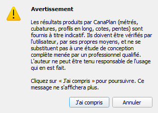
</div>

---

## 🤖 Pilotage par script

**CanaPlan se pilote entièrement par script — un chantier complet sans un seul
clic.** Les outils ont d'abord été écrits pour une souris (des `QgsMapTool`
nourris par des clics, des `QDialog` qui rendent des dictionnaires) ; c'est leur
origine, pas leur limite. Le module **`tools/api.py`** les expose en verbes
appelables depuis la console Python de QGIS, un script, un serveur MCP ou un
agent — et les **recettes** enchaînent ces verbes en procédures complètes.
Passer par la souris n'est jamais une obligation.

```python
from CanaPlan.tools import api

api.aide()                                   # sommaire des verbes disponibles
api.nouveau_projet(adresse="Rue Julien Charpentier, 03250 Châtel-Montagne")
api.attendre_fonds(["PCI - Bati"])           # le WFS est asynchrone
axe = api.axe_de_rue("Rue Julien Charpentier", "Châtel-Montagne")
api.tracer_conduite("EU", axe=axe, entraxe_max=50, diametre=200, materiau="PVC")
api.creer_branchements("EU", distance_max=8)
api.renumeroter("EU")
api.caler_cotes("EU", tn=100, pente=1.0, ancrage=("REU07", 2.50),
                tabourets={"tn": 100, "profondeur": 0.50})
api.exporter_async(echelle=200, format="A4", orientation="portrait")
api.fermer()
```

Trois partis pris, qui font toute la différence avec un pilotage naïf :

- **aucune fenêtre n'est instanciée** — les boîtes de dialogue sont neutralisées
  et leurs messages remontés dans le résultat, sous la clé `messages` ;
- **les tolérances de snap sont en mètres**, pas en pixels : le zoom cesse d'être
  un paramètre caché qui fusionnerait deux ouvrages voisins ;
- **aucune logique métier n'est réécrite.** Tout est délégué aux outils
  existants, pour que le résultat soit identique au geste manuel — snapping,
  topologie et valeurs par défaut compris.

### 🧾 Recettes

Ce qui coûte, dans un pilotage distant, ce n'est pas le calcul — les verbes
rendent la main en moins d'une seconde — c'est l'aller-retour. Une **recette**
est une procédure de travail rangée dans un fichier JSON : ses étapes, ses
paramètres et leurs valeurs par défaut. On la rejoue en un appel.

```python
api.recettes()                               # les procédures enregistrées
api.recette("collecteur_de_rue",
            adresse="Rue Julien Charpentier, 03250 Châtel-Montagne",
            rue="Rue Julien Charpentier", commune="Châtel-Montagne",
            tn=100, pente=1.0, profondeur_aval=2.50, profondeur_tabouret=0.50)
```

| Recette livrée | Ce qu'elle fait |
|---|---|
| `collecteur_de_rue` | Projet à une adresse, collecteur sur l'axe OSM, branchements, numérotation, cotes, étiquettes, enregistrement, plan PDF |
| `reseau_de_voie` | Réseau sur l'axe OSM d'une voie, un branchement par bâtiment riverain — piqué au milieu de son front de rue, arrêté en limite de parcelle —, TN sur MNT IGN, cotes facultatives |
| `coter_mnt` | Cote un réseau déjà tracé avec le TN relevé sur le MNT IGN ; seules pente et profondeurs sont saisies |
| `projet_sur_voie`, `tracer_reseau`, `habiller` | Blocs d'assemblage des recettes ci-dessus — non publiés dans Processing |
| `recaler_cotes` | Renumérote et repose TN, profondeurs et fils d'eau sur un réseau déjà tracé, puis contrôle |
| `livraison` | Styles, étiquettes, vérification, enregistrement, export PDF complet |

Deux substitutions suffisent à tout enchaîner : `"$parametre"` pour une valeur
d'appel, `"@etape.chemin"` pour le résultat d'une étape précédente. La seconde
règle un problème que rien d'autre ne règle : l'axe de rue est un
`QgsGeometry`, qui ne franchit aucun protocole — dans une recette il ne quitte
jamais QGIS.

Les cotes de chantier — TN, pente, profondeurs — n'ont volontairement **aucune
valeur par défaut** : elles changent à chaque affaire, et l'appel qui les omet
est refusé avant la première étape. `enregistrer_recette()` range une séquence
éprouvée dans le profil QGIS, sans toucher au code du plugin.

Le sens d'écoulement vient de `voie_de_raccordement`, l'exutoire — jamais du
terrain : un collecteur remonte sous une rue qui descend dès que l'exutoire est
en haut. Il se précise avec sa commune (« Rue de Venise, Vichy ») ; sans
commune, une homonyme lointaine est résolue et l'appel est refusé.

### 🧰 Recettes dans la boîte à outils Processing

Les recettes sont aussi publiées dans la **boîte à outils Processing**, sous le
fournisseur `canaplan` (groupes *Recettes livrées* et *Recettes personnelles*),
chacune avec un formulaire généré depuis ses paramètres et son aide. C'est le
catalogue qu'un agent ou un serveur MCP consulte en premier :
`execute_processing("canaplan:reseau_de_voie", …)` joue un chantier sans rien
savoir de l'API. Les algorithmes tournent sur le fil principal de QGIS.

<div align="center">
  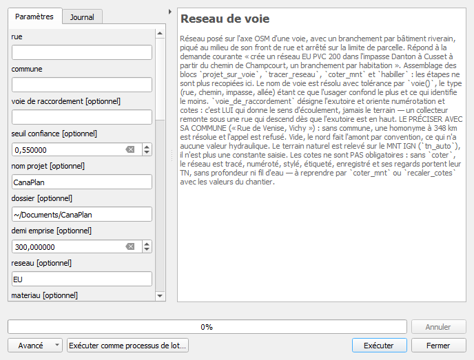
</div>

### 🌍 À l'international

```python
api.territoire("international")              # ou nouveau_projet(territoire=…)
api.nouveau_projet(adresse="Rue de Kaolack, Dakar", crs="EPSG:32628")
# → {"territoire": "international", "crs": "EPSG:32628", "deformation_pct": 0.047, "avertissements": [], …}
```

`crs` accepte un système national ; un système en degrés ou en pieds est
refusé, un système qui déforme les longueurs au chantier est rendu dans
`avertissements`. `api.territoire()` sans argument rend le territoire, le
système et son diagnostic.

> Référence complète des verbes, de leurs arguments et de leurs retours :
> **[API.md](API.md)**.

---

## 🚀 Installation

1. Téléchargez ou clonez ce dépôt :

   ```bash
   git clone https://github.com/Cartoyoyo/CanaPlan.git
   ```

2. Copiez le dossier `CanaPlan` dans le répertoire des plugins QGIS :

   `<QGIS3>` vaut `QGIS3` sous QGIS 3 et `QGIS4` sous QGIS 4 : le profil change de
   dossier avec la version majeure.

   | Système | Chemin |
   |---------|--------|
   | Windows | `C:\Users\<utilisateur>\AppData\Roaming\QGIS\<QGIS3>\profiles\default\python\plugins\` |
   | macOS   | `~/Library/Application Support/QGIS/<QGIS3>/profiles/default/python/plugins/` |
   | Linux   | `~/.local/share/QGIS/<QGIS3>/profiles/default/python/plugins/` |

3. Ouvrez QGIS, allez dans **Extensions → Installer/Gérer les extensions → Installées**, cochez **CanaPlan** et cliquez sur **OK**.

4. La barre d'outils et le panneau latéral apparaissent automatiquement.

### Prérequis

| Dépendance | Statut | Usage |
|---|---|---|
| QGIS **>= 3.40**, jusqu'à **4.x** inclus | requis | le même paquet tourne sous Qt 5 et Qt 6 |
| **matplotlib** | optionnel | profil en long, coupe transversale, dessinateur de coupes de tranchées composées |
| **ezdxf**, **fontTools**, **pyparsing** | téléchargées à la demande | export DXF et conversion DXF/DWG. Le plugin propose de les installer dans son propre dossier au premier export, sans droits administrateur — le reste de CanaPlan ne pose jamais la question |
| **pypdf** | téléchargée à la demande | assemblage du **PDF complet**. Fourni par plusieurs versions de QGIS : le cas courant est qu'il n'y ait rien à installer |
| **reportlab** | optionnel | exports PDF de cubature / remblai |
| **openpyxl** | optionnel | exports Excel de cubature / remblai |

> **QGIS 4 / Qt 6.** Depuis la version 1.8, `metadata.txt` déclare
> `qgisMinimumVersion=3.40` et `qgisMaximumVersion=4.99` : un seul paquet pour
> les deux générations. Tous les énumérés Qt et QGIS sont écrits sous leur forme
> qualifiée (`Qt.AlignmentFlag.AlignCenter`), la seule que PyQt6 accepte et qui
> reste valide sous PyQt5.

---

## 🌍 Langues · Languages

L'**interface du plugin** et **cette documentation** sont disponibles en cinq langues.

| Langue | Interface | Documentation |
|---|:---:|:---:|
| Français | ✅ | ✅ complète |
| English | ✅ | ✅ complète |
| Español | ✅ | ✅ condensée |
| Português | ✅ | ✅ condensée |
| Deutsch | ✅ | ✅ condensée |

Au premier lancement, le plugin suit la langue de QGIS. Dès que vous choisissez une langue, ce choix est mémorisé et prime sur celle de QGIS — l'entrée **Automatique (langue de QGIS)** rétablit le suivi. Le sélecteur est présent à trois endroits, synchronisés entre eux : en pied du **panneau latéral**, dans **Extensions → CanaPlan → Langue**, et dans la fenêtre **À propos**. Le changement est immédiat, sans redémarrage.

> Les listes de valeurs du géostandard **StaR-Eau** ne sont pas traduites : leurs codes et libellés sont normatifs (CNIG / ASTEE) et servent de clés étrangères dans le modèle PostGIS.

Le séparateur décimal des rapports suit la langue : `128,31` en français, espagnol, portugais et allemand, `128.31` en anglais.

---

## 🇬🇧 English

### 📝 Description

**CanaPlan** is a design-drawing tool for laying out **wastewater (EU)** and **stormwater (EP)** sewer networks, and since 2.2 **drinking-water (AEP)** networks, directly inside QGIS, over a basemap the plugin loads for you (BAN addresses, PCI cadastre, IGN orthophoto, OSM, or an existing DXF/DWG drawing), with native geometric continuity: every pipe joins two structures, and every service connection re-anchors itself onto its parent pipe when that pipe moves, with validation on save.

Network slope can be set or corrected straight from the drawing and data-entry tools (a four-step project wizard, a bulk entry table). The plugin produces longitudinal profiles (EU / EP / combined), computes trench volumes (excavation and imported backfill materials), generates cross-section drawings, prints multi-sheet orientable PDF plans with an overview sheet, and exports faithful DXF 2018.

From field survey to delivery, one tool covers the whole chain: Star-DT / StaR-Elec (DT-DICT) import, IGN/BAN/PCI basemaps fetched in the background, and GeoPackage export compliant with the **StaR-Eau V2024** geostandard (CNIG / ASTEE).

> Workflow screenshots are in the [Captures d'écran](#-captures-décran) section above.

### ⚙️ Features

- **Topological drawing:** each pipe vertex creates a manhole; service connections tap into an existing pipe and run to a structure.
- **Attribute form:** hover to highlight, click to edit. Numeric fields accept **additive expressions** (`1-0.25` → `0.750`); ground level, invert level and depth recompute from one another.
- **Move with re-anchoring:** moving a structure drags the connected pipes and connections along. Tap-in points slide along their parent pipe, updating chainage and tap-in level.
- **Slope entry table:** find the chain between two manholes, then apply a constant slope, a slope computed from the two known invert levels, or a fixed depth over the whole chain.
- **Longitudinal profiles:** EU, EP or combined along a drawn axis, with a value table and tap-in markers.
- **Trench volumes and backfill:** excavation and imported materials broken down into bedding, surround, pipe and backfill, with optional road sub-base and surface course.
- **Cross sections and a composite trench designer**, exportable to PDF and PNG.
- **Labels:** fixed point size or scaled to a printing scale, with a zoom-out threshold, per-network and per-type visibility, and a choice of displayed fields.
- **Renumbering** of manholes and inspection chambers along a chain, with configurable prefixes and starting numbers.
- **Multi-sheet printing:** place sheets on the map, aim each one with the mouse, then export a PDF with an optional overview page, or a DXF 2018 plan.
- **Scripting API** (`tools/api.py`): every tool as a callable verb from the Python console, a script or an agent — no dialogs, snapping tolerances in metres, serialisable results. Reusable procedures are declared as JSON **recipes** and replayed in a single call. See [API.md](API.md).
- **StaR-Eau V2024 export** to GeoPackage, with a compliance check that lists blocking issues before writing.
- **France / International territory:** outside France, addresses and buildings come from OpenStreetMap, aerial imagery from Esri World Imagery, and a UTM zone is proposed from the address. A guard measures the chosen CRS's length distortion on site and rejects degree- or foot-based systems — left in Lambert 93, a project in Abidjan stretched every length by 25 %.
- **Recipes in the Processing Toolbox** (`canaplan` provider), and a usage disclaimer shown on first use and in trench-volume reports.
- **Star-DT / StaR-Elec (DT-DICT) import** and DXF/DWG import into GeoPackage.
- **Drinking-water network (AEP)**, new in 2.2: nodes typed as valve, air valve, drain, fire hydrant, pressure reducer or network meter, drawn with the **StaR-Eau symbols**; a service-connection valve placed at each tap-in; invert levels derived from the cover depth; profiles, trench volumes, cross sections, plans and StaR-Eau "EAU" export all handle AEP. See [💧 Réseau AEP](#-réseau-aep--eau-potable).
- **Magic Box**: automatic service connections on the pipes you click — one per parcel, per building or per street number, on both sides or one — previewed before drawing.
- **SchemAEP**: a fittings diagram for each water node (tees, valves, flanges, sockets, hydrants…), started from the pipes that reach the node and the fitting of its type, with joint checks and bill of materials; saved on the node in the `.bet`, exported as PDF pages (6 diagrams per A4 sheet) and SVG files. See [📐 SchemAEP](#-schemaep--schémas-de-nœuds-aep).
- **Data-entry table, SLOPE chain**: water meters can start or end a chain (through their service connection).
- **New in 2.4**: redesigned PDF title block (scale bar, north arrow, networks, CRS and heights, revision, location mini-map), basemap fallback when a tile server stalls (print without it or retry in 2 minutes), timed export progress window, labels that avoid pipes, customisable coloured side panel.

### 📋 Requirements

| Dependency | Status | Used for |
|---|---|---|
| QGIS **>= 3.40**, up to **4.x** | required | one package runs on both Qt 5 and Qt 6 |
| **matplotlib** | optional | longitudinal profiles, cross sections, composite trench designer |
| **ezdxf**, **fontTools**, **pyparsing** | downloaded on demand | DXF export and DXF/DWG conversion. The plugin offers to install them into its own folder on the first export, without administrator rights |
| **pypdf** | downloaded on demand | assembling the **complete PDF**. Shipped by several QGIS versions, so usually there is nothing to install |
| **reportlab** | optional | volume / backfill PDF reports |
| **openpyxl** | optional | volume / backfill Excel reports |

> **QGIS 4 / Qt 6.** From version 1.8 on, `metadata.txt` declares
> `qgisMinimumVersion=3.40` and `qgisMaximumVersion=4.99`: a single package for
> both generations. Every Qt and QGIS enum is written in its scoped form
> (`Qt.AlignmentFlag.AlignCenter`), the only one PyQt6 accepts and one that
> stays valid under PyQt5.

### 🚀 Installation

1. Download or clone this repository:

   ```bash
   git clone https://github.com/Cartoyoyo/CanaPlan.git
   ```

2. Copy the `CanaPlan` folder into the QGIS plugins directory:

   | System | Path |
   |---------|--------|
   | Windows | `C:\Users\<user>\AppData\Roaming\QGIS\QGIS3\profiles\default\python\plugins\` |
   | macOS   | `~/Library/Application Support/QGIS/QGIS3/profiles/default/python/plugins/` |
   | Linux   | `~/.local/share/QGIS/QGIS3/profiles/default/python/plugins/` |

3. Open QGIS, go to **Plugins → Manage and Install Plugins → Installed**, tick **CanaPlan** and click **OK**.

4. A single icon appears in the Plugins toolbar; it shows and hides the side panel, which is the plugin's only interface.

### 📦 The .bet project format

A CanaPlan project is a single `.bet` file — a ZIP archive holding a `metadata.json` manifest, a `data.gpkg` GeoPackage with the working layers (plus the `schema_aep` table of SchemAEP node diagrams), and a `fonds/` folder with the basemaps. Two rotating backups (`.bak1`, `.bak2`) are kept beside it.

Basemaps are saved with the project: WMS streams by reference (URI, opacity, scale thresholds), while vector layers — BAN addresses, street names, PCI, DXF and Star-DT imports — are copied into the archive with their style, so they survive the temporary-folder purge and travel with the project.

---

## 🇪🇸 Español

> Las capturas de pantalla del flujo de trabajo se encuentran en la sección [Captures d'écran](#-captures-décran) al inicio de este documento.

### 📝 Descripción

**CanaPlan** es una herramienta de dibujo de proyecto que permite trazar redes de saneamiento de **aguas residuales (EU)** y **aguas pluviales (EP)**, y desde la 2.2 redes de **agua potable (AEP)**, directamente en QGIS, sobre un mapa base que el propio complemento carga (direcciones BAN, catastro PCI, ortofoto IGN, OSM o un plano DXF/DWG existente), con continuidad geométrica nativa: cada tubería une dos obras y cada acometida se reajusta automáticamente sobre su tubería madre cuando esta se mueve.

Del levantamiento de campo a la entrega, una sola herramienta cubre toda la cadena: importación Star-DT / StaR-Elec (DT-DICT), mapas base IGN/BAN/PCI cargados en segundo plano y exportación GeoPackage conforme al geoestándar **StaR-Eau V2024** (CNIG / ASTEE).

### ⚙️ Funcionalidades

- **Dibujo topológico:** cada vértice de tubería crea un pozo; las acometidas se conectan a una tubería existente y llegan hasta una obra.
- **Formulario de atributos** con expresiones aditivas y recálculo automático de cota de terreno, cota de solera y profundidad.
- **Movimiento con reajuste** de las tuberías y acometidas conectadas.
- **Tabla de entrada de pendiente** sobre la cadena entre dos pozos: pendiente constante, calculada o profundidad fija.
- **Perfiles longitudinales** EU, EP o agrupados, con tabla de valores.
- **Cubicación y relleno:** desmonte y materiales aportados desglosados (cama, recubrimiento, tubería, relleno, calzada).
- **Secciones transversales** y diseñador de zanjas compuestas, exportables a PDF y PNG.
- **Etiquetas** con tamaño fijo o adaptado a la escala de impresión, y umbral de visualización.
- **Impresión multihoja** en PDF con plano de conjunto, y exportación DXF 2018.
- **Exportación StaR-Eau V2024** a GeoPackage, con control de conformidad previo.
- **Territorio Francia / Internacional:** fuera de Francia, direcciones y edificios de OpenStreetMap, ortofoto Esri World Imagery y zona UTM propuesta a partir de la dirección, con control de la deformación de las longitudes.
- **Red de agua potable (AEP)**, nueva en la 2.2: nodos tipados (válvula, ventosa, desagüe, hidrante, reductor de presión, contador), **símbolos StaR-Eau**, llave de acometida en cada toma, cota de solera deducida del recubrimiento, y exportación StaR-Eau « EAU ».
- **Magic Box:** acometidas automáticas sobre los tramos elegidos — por parcela, edificio o número de calle — con vista previa.
- **SchemAEP:** esquema de piezas de cada nodo de agua potable (tes, válvulas, bridas, enchufes, hidrantes…), iniciado a partir de las tuberías que llegan al nodo, con control de uniones y lista de materiales; guardado en el `.bet` y exportado en PDF (6 esquemas por hoja A4) y SVG.

### 🚀 Instalación

1. Clone el repositorio: `git clone https://github.com/Cartoyoyo/CanaPlan.git`
2. Copie la carpeta `CanaPlan` en el directorio de complementos de QGIS (rutas en la sección [Installation](#-installation)).
3. En QGIS, vaya a **Complementos → Administrar e instalar complementos → Instalados**, marque **CanaPlan** y pulse **Aceptar**.
4. Un único icono aparece en la barra de complementos: muestra y oculta el panel lateral.

Requisitos: QGIS **>= 3.40**, hasta **4.x** (Qt 5 y Qt 6 con el mismo paquete); *matplotlib*, *reportlab* y *openpyxl* son opcionales; *ezdxf* y *pypdf* se descargan a petición, en la primera exportación que las necesite.

---

## 🇵🇹 Português

> As capturas de ecrã do fluxo de trabalho encontram-se na secção [Captures d'écran](#-captures-décran) no início deste documento.

### 📝 Descrição

**CanaPlan** é uma ferramenta de desenho de projeto que permite traçar redes de saneamento de **águas residuais (EU)** e **águas pluviais (EP)**, e desde a 2.2 redes de **água potável (AEP)**, diretamente no QGIS, sobre um mapa base que o próprio módulo carrega (endereços BAN, cadastro PCI, ortofoto IGN, OSM ou uma planta DXF/DWG existente), com continuidade geométrica nativa: cada conduta liga duas estruturas e cada ramal reajusta-se automaticamente à sua conduta principal quando esta se desloca.

Do levantamento de campo à entrega, uma só ferramenta cobre toda a cadeia: importação Star-DT / StaR-Elec (DT-DICT), mapas base IGN/BAN/PCI carregados em segundo plano e exportação GeoPackage conforme ao geopadrão **StaR-Eau V2024** (CNIG / ASTEE).

### ⚙️ Funcionalidades

- **Desenho topológico:** cada vértice de conduta cria uma caixa; os ramais ligam-se a uma conduta existente e terminam numa estrutura.
- **Formulário de atributos** com expressões aditivas e recálculo automático de cota do terreno, soleira e profundidade.
- **Deslocação com reajuste** das condutas e ramais ligados.
- **Tabela de entrada de declive** na cadeia entre duas caixas: declive constante, calculado ou profundidade fixa.
- **Perfis longitudinais** EU, EP ou agrupados, com tabela de valores.
- **Cubagem e aterro:** escavação e materiais aplicados decompostos (leito, envolvimento, conduta, aterro, faixa de rodagem).
- **Cortes transversais** e desenhador de valas compostas, exportáveis para PDF e PNG.
- **Rótulos** com tamanho fixo ou adaptado à escala de impressão, e limiar de exibição.
- **Impressão multifolha** em PDF com planta de conjunto, e exportação DXF 2018.
- **Exportação StaR-Eau V2024** para GeoPackage, com controlo de conformidade prévio.
- **Território França / Internacional:** fora de França, moradas e edifícios do OpenStreetMap, ortofoto Esri World Imagery e zona UTM proposta a partir da morada, com controlo da deformação dos comprimentos.
- **Rede de água potável (AEP)**, nova na 2.2: nós tipados (válvula, ventosa, descarga, marco de incêndio, redutor de pressão, contador), **símbolos StaR-Eau**, válvula de ramal em cada ligação, soleira deduzida do recobrimento, e exportação StaR-Eau « EAU ».
- **Magic Box:** ramais automáticos nos troços escolhidos — por parcela, edifício ou número de porta — com pré-visualização.
- **SchemAEP:** esquema de peças de cada nó de água potável (tês, válvulas, flanges, bocas, marcos de incêndio…), iniciado a partir das condutas que chegam ao nó, com controlo das ligações e lista de materiais; guardado no `.bet` e exportado em PDF (6 esquemas por folha A4) e SVG.

### 🚀 Instalação

1. Clone o repositório: `git clone https://github.com/Cartoyoyo/CanaPlan.git`
2. Copie a pasta `CanaPlan` para o diretório de módulos do QGIS (caminhos na secção [Installation](#-installation)).
3. No QGIS, vá a **Módulos → Gerir e instalar módulos → Instalados**, marque **CanaPlan** e clique em **OK**.
4. Um único ícone aparece na barra de módulos: mostra e oculta o painel lateral.

Requisitos: QGIS **>= 3.40**, até **4.x** (Qt 5 e Qt 6 com o mesmo pacote); *matplotlib*, *reportlab* e *openpyxl* são opcionais; *ezdxf* e *pypdf* são descarregados a pedido, na primeira exportação que os exija.

---

## 🇩🇪 Deutsch

> Die Bildschirmfotos des Arbeitsablaufs finden Sie im Abschnitt [Captures d'écran](#-captures-décran) am Anfang dieses Dokuments.

### 📝 Beschreibung

**CanaPlan** ist ein Entwurfswerkzeug zum Zeichnen von **Schmutzwasser- (EU)** und **Regenwasserkanalnetzen (EP)**, seit 2.2 auch von **Trinkwassernetzen (AEP)**, direkt in QGIS, über einer Hintergrundkarte, die die Erweiterung selbst lädt (BAN-Adressen, PCI-Kataster, IGN-Orthofoto, OSM oder eine vorhandene DXF/DWG-Zeichnung), mit nativer geometrischer Kontinuität: Jede Leitung verbindet zwei Bauwerke, und jeder Hausanschluss richtet sich automatisch neu an seiner Hauptleitung aus, wenn diese verschoben wird.

Von der Feldaufnahme bis zur Übergabe deckt ein einziges Werkzeug die gesamte Kette ab: Star-DT- / StaR-Elec-Import (DT-DICT), im Hintergrund geladene IGN/BAN/PCI-Hintergrundkarten und GeoPackage-Export konform zum Geostandard **StaR-Eau V2024** (CNIG / ASTEE).

### ⚙️ Funktionen

- **Topologisches Zeichnen:** Jeder Leitungsknoten erzeugt einen Schacht; Hausanschlüsse binden an eine bestehende Leitung an und enden an einem Bauwerk.
- **Attributformular** mit additiven Ausdrücken und automatischer Neuberechnung von Geländehöhe, Sohlhöhe und Tiefe.
- **Verschieben mit Nachführung** der angeschlossenen Leitungen und Hausanschlüsse.
- **Gefälle-Eingabetabelle** für die Kette zwischen zwei Schächten: konstantes, berechnetes Gefälle oder feste Tiefe.
- **Längsschnitte** EU, EP oder kombiniert, mit Werttabelle.
- **Massenberechnung und Verfüllung:** Aushub und eingebaute Materialien aufgeschlüsselt (Bettung, Ummantelung, Leitung, Verfüllung, Fahrbahn).
- **Querschnitte** und Zeichner für zusammengesetzte Gräben, als PDF und PNG exportierbar.
- **Beschriftungen** mit fester Größe oder an den Druckmaßstab angepasst, mit Anzeigeschwelle.
- **Mehrblattdruck** als PDF mit Übersichtsplan sowie DXF-2018-Export.
- **StaR-Eau-V2024-Export** ins GeoPackage, mit vorheriger Konformitätsprüfung.
- **Gebiet Frankreich / International:** außerhalb Frankreichs Adressen und Gebäude aus OpenStreetMap, Luftbild Esri World Imagery und eine aus der Adresse vorgeschlagene UTM-Zone, mit Prüfung der Längenverzerrung.
- **Trinkwassernetz (AEP)**, neu in 2.2: typisierte Knoten (Schieber, Be-/Entlüfter, Entleerung, Hydrant, Druckminderer, Netzzähler), **StaR-Eau-Symbole**, Anschlussschieber an jedem Abzweig, Sohlhöhe aus der Überdeckung, und StaR-Eau-Export « EAU ».
- **Magic Box:** automatische Hausanschlüsse an den gewählten Leitungsabschnitten — je Flurstück, Gebäude oder Hausnummer — mit Vorschau.
- **SchemAEP:** Formstückschema für jeden Trinkwasserknoten (T-Stücke, Schieber, Flansche, Muffen, Hydranten…), ausgehend von den am Knoten ankommenden Leitungen, mit Verbindungsprüfung und Stückliste; im `.bet` gespeichert, Export als PDF (6 Schemata je A4-Blatt) und SVG.

### 🚀 Installation

1. Repository klonen: `git clone https://github.com/Cartoyoyo/CanaPlan.git`
2. Den Ordner `CanaPlan` in das QGIS-Erweiterungsverzeichnis kopieren (Pfade im Abschnitt [Installation](#-installation)).
3. In QGIS **Erweiterungen → Erweiterungen verwalten und installieren → Installiert** öffnen, **CanaPlan** ankreuzen und auf **OK** klicken.
4. Ein einziges Symbol erscheint in der Erweiterungs-Werkzeugleiste; es blendet die Seitenleiste ein und aus.

Voraussetzungen: QGIS **>= 3.40**, bis **4.x** (Qt 5 und Qt 6 mit demselben Paket); *matplotlib*, *reportlab* und *openpyxl* sind optional; *ezdxf* und *pypdf* werden beim ersten Export, der sie benötigt, heruntergeladen.

---

## 🌳 Structure du projet

```
CanaPlan/
├── main.py                         # Classe principale du plugin
├── config_dialog.py                # Dialogue de configuration (reseaux, couches, cubature, remblai)
├── __init__.py
├── metadata.txt
├── gui/
│   ├── __init__.py
│   ├── side_panel.py               # Panneau lateral (arbre des outils)
│   ├── etiquettes.py               # Moteur d'etiquettes QGIS
│   ├── renseignement_dialog.py     # Formulaire d'attributs
│   ├── print_settings_widget.py    # Bloc reglages du plan (format/echelle/dpi/cadrage), partage export + impression
│   ├── print_dialog.py             # Fenetre de reglages, rouverte par Echap pendant la pose
│   ├── profil_dialog.py            # Affichage du profil en long (matplotlib)
│   ├── profil_groupe_dialog.py     # Profil groupe EU + EP (matplotlib)
│   ├── coupe_transversale_dialog.py# Plan de coupe transversale (matplotlib) + plan de situation QGIS
│   ├── cubature_dialog.py          # Tableau resultats cubature/remblai + exports CSV/PDF/Excel
│   ├── etiquette_taille_dialog.py  # Dialogue de reglage de la taille des etiquettes
│   ├── etiquette_affichage_dialog.py # Dialogue de gestion de l'affichage des etiquettes
│   ├── coupe_tranchee_composee_dialog.py # Dessinateur de coupes de tranchees composees (EU/EP/AEP, matplotlib)
│   ├── annotation_dialog.py        # Dialogue d'annotation (texte, police, couleur, cadre, transparence)
│   ├── tableau_saisie_dialog.py    # Tableau de saisie groupee (regards/tabourets/conduites/branchements)
│   ├── chain_profile_widget.py     # Widget du profil simplifie pour l'onglet Chaine du tableau de saisie
│   ├── export_dialog.py            # Fenetre unique d'export : sorties + reglages du plan + raccourcis Toutes les pieces (ZIP) et PDF complet
│   ├── suivi_export.py             # Fenetre de suivi d'export : sorties demandees ou non, etat et temps de chaque etape
│   ├── interface_config_widget.py  # Onglet Interface de la configuration rapide (langue, apparence, contenu du panneau)
│   ├── welcome_dialog.py           # Dialogue d'accueil (assistant / ouvrir / annuler)
│   ├── recent_projects_dialog.py   # Liste des projets .bet recemment ouverts
│   ├── dependances_dialog.py       # Proposition d'installation des librairies manquantes (ezdxf, pypdf)
│   ├── project_wizard_dialog.py    # Assistant de creation de projet (adresse, fonds de plan, config rapide, recap)
│   ├── quick_config_widgets.py     # Widgets Reseau/Cubature/Remblai partages entre ConfigDialog et l'assistant
│   ├── ban_search_widget.py        # Barre de recherche d'adresse avec suggestions (BAN en France, Photon/OSM ailleurs)
│   ├── star_dt_dialog.py           # Dialogue d'import GML Star-DT / StaR-Elec (multi-fichiers + drag & drop)
│   ├── stareau_export_dialog.py    # Dialogue d'export StaR-Eau (5 onglets + controle)
│   ├── about_dialog.py             # Dialogue « A propos » (lit metadata.txt)
│   ├── magic_box_dialog.py         # Magic Box : tuiles, selection des troncons, apercu, trace
│   ├── schemaep_choix_dialog.py    # SchemAEP : choix du noeud (liste / carte), liaison au .bet, nomenclature chantier
│   ├── schemaep_fenetre.py         # SchemAEP : fenetre (palette, favoris, barre d'outils, sorties)
│   ├── schemaep_canevas.py         # SchemAEP : zone de dessin (scene Qt, souris, aimantation)
│   ├── schemaep_panneau.py         # SchemAEP : proprietes, extremites, controle, nomenclature, legende
│   ├── schemaep_sorties.py         # SchemAEP : SVG autonome, impression, PDF 6 schemas par A4
│   └── config_dialog.py            # Dialogue de configuration (reseaux, couches, cubature, remblai)
├── API.md                          # Reference du module de pilotage par script
├── tools/
│   ├── __init__.py                 # Utilitaire partage layer_ok()
│   ├── i18n.py                     # Table de traduction FR/EN/ES/PT/DE et resolution de la langue
│   ├── errlog.py                   # Journal QGIS onglet CanaPlan, plafonne (erreurs jusqu'ici avalees)
│   ├── dependances.py              # Installation a la demande dans libs/ : ezdxf/fontTools/pyparsing (DXF), pypdf (PDF complet)
│   ├── fonds_plan.py               # Chargement des fonds de plan (BAN, PCI, ortho IGN, OSM)
│   ├── territoire.py               # Territoire France / International, systeme de coordonnees, controle de deformation
│   ├── osm_services.py             # Recherche d'adresse Photon / Nominatim, bati OSM (Overpass) en tache de fond
│   ├── avertissement.py            # Avertissement d'usage : fenetre a la premiere utilisation, mentions des rapports
│   ├── processing_provider.py      # Recettes publiees dans la boite a outils Processing (fournisseur canaplan)
│   ├── reseaux.py                  # Registre des reseaux EU/EP/AEP : couleurs, types AEP, prefixes, couverture, vocabulaire
│   ├── style_aep.py                # Symbologie AEP par type (SVG StaR-Eau), bouches a cle
│   ├── aep_topo.py                 # Robinets de branchement recales, orientation des symboles AEP
│   ├── appareil_aep_tool.py        # Outil « Poser un appareil AEP »
│   ├── stareau_export_aep.py       # Export StaR-Eau des tables aep_* (fichier EAU)
│   ├── magic_branchements.py       # Moteur des branchements automatiques (parcelle, bati, numero)
│   ├── i18n_aep.py / i18n_magic.py # Traductions AEP et Magic Box
│   ├── i18n_schemaep.py            # Traductions de l'interface SchemAEP
│   ├── schemaep/                   # SchemAEP, moteur en Python pur (sans Qt) :
│   │   ├── catalogue.py            #   64 pieces, extremites et compatibilites, symbologie
│   │   ├── moteur.py               #   raccordements, controles, nomenclature, etiquettes, format .json
│   │   ├── montages.py             #   montages types des favoris
│   │   ├── svg_qt.py               #   dessins → SVG autonomes pour QSvgRenderer
│   │   ├── prefill.py              #   schema de depart d'un noeud (conduites + appareil)
│   │   ├── langue.py               #   langue d'affichage du catalogue (moteur et .json en français)
│   │   ├── traductions.py          #   catalogue traduit : pièces, champs, nomenclature, contrôles
│   │   └── stockage.py             #   table schema_aep du .bet, rattachement aux noeuds
│   ├── draw_conduite_tool.py       # Trace des conduites
│   ├── draw_branchement_tool.py    # Trace des branchements
│   ├── insert_regard_tool.py       # Insertion de regard sur conduite
│   ├── renseignement_tool.py       # Survol et saisie des attributs
│   ├── move_tool.py                # Deplacement d'ouvrages
│   ├── delete_tool.py              # Suppression d'elements
│   ├── copy_attributes_tool.py     # Copie d'attributs entre elements
│   ├── profil_tool.py              # Profil en long (BFS + ProfilDialog)
│   ├── profil_groupe_tool.py       # Profil groupe EU + EP (BFS + ProfilGroupeDialog)
│   ├── renommer_tool.py            # Renumerotation le long d'un chemin BFS
│   ├── cubature_tool.py            # Selection BFS/axe pour cubature/remblai tranchees
│   ├── calc_cubature.py            # Calcul cubature (volumes, BFS, remblai par couche)
│   ├── print_tool.py               # Impression PDF multi-planches (pose manuelle ou cadrage automatique)
│   ├── api.py                      # Facade de pilotage : verbes metier sans fenetre, suites et recettes
│   ├── notification.py             # Compte rendu de fin d'export dans la barre de messages (bouton Ouvrir le dossier)
│   ├── panneau_prefs.py            # Contenu du panneau lateral (donnees) et preferences Interface
│   ├── recettes/                   # Procedures rejouables (JSON) : collecteur_de_rue, recaler_cotes, livraison
│   ├── cadrage_auto.py             # Decoupage automatique en planches : couverture minimale, ordre aval-amont, marge etiquettes
│   ├── coupe_type.py               # Coupe type EU/EP calculee sur les statistiques du reseau (sans troncon designe)
│   ├── coupe_transversale_tool.py  # Outil de trace de l'axe de coupe (EU+EP ou mono-reseau)
│   ├── annotation_tool.py          # Outil d'annotation texte (clic / ctrl+clic / ctrl+c-v)
│   ├── profil_batch.py             # Export batch profils EU/EP/groupe (ExportDialog)
│   ├── dxf_export.py               # Export DXF 2018 (pattern QgsDxfExport canonique)
│   ├── dxf_postprocess.py          # Decoration ezdxf (fond + cadre + callout etiquettes, symboles, ltscale)
│   ├── star_dt_import.py           # Import GML Star-DT / StaR-Elec (multi-fichiers, types et champs decouverts)
│   ├── stareau_values.py           # Listes de valeurs officielles StaR-Eau V2024 + materiaux partages
│   ├── stareau_export.py           # Export GeoPackage conforme StaR-Eau (UUID v5, orientation, controle)
│   ├── projet_bet.py               # Sauvegarde / chargement .bet (archive ZIP)
│   ├── graph_utils.py              # Construction graphe + BFS (partages par tous les outils BFS)
│   ├── calc_pentes.py              # Recalcul des pentes a partir des FE radier
│   ├── layer_keys.py               # Persistance des identifiants de couches dans le projet (.qgs)
│   ├── spatial_utils.py            # Recherche spatiale indexee (point/ligne les plus proches), partagee
│   ├── wfs_utils.py                 # Telechargement WFS mutualise en tache de fond (BAN/PCI/BD TOPO)
│   ├── ban_search.py                # Recherche d'adresse BAN avec debounce (etape 1 de l'assistant)
│   └── dxf_convert/                # Conversion DXF/DWG vers couches vectorielles
│       ├── ui_dialog.py            # Dialogue principal
│       ├── alg_cad_to_gis_convert.py
│       └── services/
└── icon/                           # Icones SVG de la barre d'outils
    └── stareau_aep/                # Symboles AEP du geostandard StaR-Eau (+ licence)
```

---

## 📜 Changelog

| Version | Notes |
|---------|-------|
| **2.4** | **Cartouche** repensé (barre d'échelle, nord, réseaux, références, indice, mini-plan de situation) — **fonds indisponibles** : nouvel essai puis choix sans fond / réessayer dans 2 min — **fenêtre de suivi de l'export** chronométrée — cadrage automatique sans planche tête en bas, planches réparties et moins nombreuses — **onglet Interface** (panneau coloré, ordre des entrées) — étiquettes qui évitent les conduites — Magic Box : portée réglable — fenêtre d'export compacte, cubature par réseau — correctifs : robinets AEP du mauvais côté sur les planches tournées, outil actif et tableau de saisie cassés après enregistrement ou chargement du `.bet`, choix du dossier masqué dans l'assistant en mode International, branchements AEP sans repère sur le profil en long |
| **2.3** | **SchemAEP** : schéma de pièces de chaque nœud AEP, pré-rempli depuis les conduites et le type du nœud, contrôle des assemblages et nomenclature, rangé dans le `.bet` (table `schema_aep`), copier / coller entre nœuds, bouton dans Renseigner, pages PDF « 6 schémas par A4 » et SVG à l'export, nomenclature du chantier — **Tableau de saisie** : compteurs AEP en départ ou arrivée de la chaîne PENTE — SchemAEP en 5 langues — cadrage automatique : moins de planches à grande échelle — correctifs : branchements AEP absents des profils en long après la coupe de leur conduite, symboles AEP masqués dans le DXF, options d'étiquettes ignorées au PDF |
| **2.2** | **Réseau AEP (eau potable)** : troisième réseau complet, symboles StaR-Eau, nœuds typés, robinets de branchement, fil d'eau par la couverture, profils / cubature / coupes / plans / export StaR-Eau « EAU » — **Magic Box** : branchements automatiques par parcelle, bâti ou numéro, avec aperçu — correctifs : conduite de longueur nulle en fin de tracé, coupe d'une conduite dans un projet GeoPackage (clé `fid` dupliquée) |
| **2.1.1** | Correctif de publication : `metadata.txt` refusé par plugins.qgis.org (signe `%` dans le changelog) — contenu identique à la 2.1 |
| **2.1** | **Territoire International** : projets hors de France avec adresses et bâti OpenStreetMap, photo aérienne Esri et système UTM proposé, sous garde-fou de déformation des longueurs — **avertissement d'usage** — **recettes dans la boîte à outils Processing** — branchements automatiques centrés sur le front de rue et arrêtés en limite de parcelle — sens d'écoulement lu sur l'exutoire, plus sur le terrain |
| **2.0** | **TN auto (MNT IGN)** : remplissage du terrain naturel des regards et tabourets depuis le LiDAR HD (repli RGE ALTI), avec aperçu avant écriture et rapport CSV de traçabilité — cinq nouvelles **recettes** de pilotage par script (`coter_mnt`, `habiller`, `projet_sur_voie`, `reseau_de_voie`, `tracer_reseau`) — correction d'un plantage à la création de couche sur un projet neuf en CRS géographique — la fenêtre de résultats Cubature ne s'accumule plus d'un calcul à l'autre — icône du plugin dans le menu Extensions |
| **1.9** | **Pilotage par script** (`tools/api.py`) et **recettes** rejouables — numérotation des planches suivant le collecteur, de l'aval vers l'amont — taille des étiquettes en millimètres de papier — requêtes BAN et Overpass par la pile réseau de QGIS |
| **1.8** | Compatibilité **QGIS 4 / Qt 6** — bouton **PDF complet** dans la fenêtre d'export — profils en long toujours orientés regard le plus profond à gauche — seuil de dézoom des étiquettes déduit de l'échelle cible |
| **1.7.1** | Retrait du paquet des scripts de mise au point du parseur DXF, qui bloquaient la validation de sécurité de plugins.qgis.org |
| **1.7** | Librairies DXF installées à la demande depuis PyPI : le paquet passe de 26,8 à 2,7 Mo |
| **1.6.2** | Paquet allégé et durci : numpy n'est plus embarqué, GML avec DOCTYPE refusés, WFS restreint à http/https, erreurs tracées dans le journal QGIS |
| **1.6** | Cadrage automatique des planches et numérotation de proche en proche — fenêtre d'export unique — bouton « Toutes les pièces (ZIP) » — export PDF quatre fois plus rapide |
| **1.5** | Interface entièrement multilingue (FR / EN / ES / PT / DE), rapports et plans compris |
| **1.4** | Assistant de création de projet en 4 étapes (adresse BAN, fonds de plan, configuration rapide, récapitulatif) — PCI Vecteur basculé sur le Parcellaire Express IGN — Couches de fond WFS mises à jour en place |
| **1.3** | Export StaR-Eau V2024 (CNIG/ASTEE), GeoPackage 5 couches, UUID v5 déterministes — Import Star-DT étendu à StaR-Elec, multi-fichiers et glisser-déposer — Interpolation en cascade des cotes de piquage |
| **1.2** | Fusion Cubature / Remblai en une fenêtre unique avec détail à la volée — Tableau de saisie groupée (Ctrl+Z, copier/coller Excel) — Réseau AEP dans le dessinateur de coupes composées |
| **1.1** | Rendu PDF parallèle et annulable — Index spatiaux sur tous les outils carte — Fonds WFS chargés en tâche de fond sans geler QGIS |
| **1.0** | Version initiale |

<details>
<summary>Détail complet des versions</summary>

### 2.4

- **Cartouche du plan PDF** : titre du plan et objet (« Plan de réseau EU ·
  AEP »), format et échelle avec **barre graduée**, **flèche du nord** tournée
  comme la planche, trait de couleur par réseau présent, système de
  coordonnées et altitudes NGF-IGN69 (France), date et **indice de révision**,
  numéro de planche et **mini-plan de situation**. La carte n'est plus
  masquée par la barre d'échelle ni la flèche.
- **Fenêtre d'export** : titre du plan par défaut = nom du projet, champ
  *Indice*, 150 dpi par défaut quel que soit le format, cubature par réseau
  (cases EU / EP / AEP), mise en page compacte (706 → 386 px de haut) et
  cases aux couleurs des réseaux.
- **Fonds de plan à l'impression** : délai de 20 s par image, nouvel essai
  automatique des planches incomplètes, puis choix *imprimer sans ce fond* /
  *réessayer dans 2 min* / *tel quel* ; fenêtre de progression détaillée
  (chrono par carte, images attendues par serveur).
- **Fenêtre de suivi de l'export** (toutes les sorties, état et temps) ;
  comptes rendus sans *OK* à cliquer, avec « Ouvrir le dossier » ; le DXF ne
  s'ouvre plus automatiquement.
- **Cadrage automatique** : nord toujours vers le haut, planches réparties
  régulièrement et superflues retirées, quadrillage nord en haut retenu
  secteur par secteur quand il économise une planche.
- **Étiquettes** : conduites et branchements obstacles même masqués ;
  étiquette écartée jusqu'à 8 m (connecteur allongé) plutôt que supprimée ;
  compteurs AEP étiquetés du côté opposé à la conduite.
- **Magic Box** : portée max réglable dans l'aperçu, avec *Recalculer* ;
  l'aperçu s'ouvre même sans proposition.
- **Onglet Interface** de la configuration rapide (langue, panneau coloré ou
  classique, ordre et visibilité des entrées) ; Magic Box sous *Configuration
  rapide* ; entrée survolée en gras ; configuration rapide redimensionnable.
- **Overpass** : 35 s par miroir, miroir défaillant relégué en fin de tour,
  message d'erreur lisible.
- **Corrections** : robinets de branchement AEP décalés du mauvais côté sur
  les planches tournées ; outil de dessin actif et tableau de saisie pointant
  sur des couches détruites après l'enregistrement ou le chargement d'un
  `.bet` ; bouton *Parcourir* hors de la fenêtre dans l'assistant en mode
  International ; branchements AEP sans repère sur le profil en long
  (repère « Br n » à défaut de nom).

### 2.3

- **SchemAEP** (dossier *AEP – Eau Potable*) : éditeur de schémas de pièces
  des nœuds AEP, portage Python/Qt de la page autonome SchemAEP (même
  catalogue de 64 pièces, mêmes contrôles, même format `.json`). Fenêtre non
  bloquante : palette et favoris, raccordement assisté et aimantation,
  extrémités au choix point par point, contrôle des assemblages avec
  validation des défauts, nomenclature, étiquettes sans chevauchement,
  Effacer tout, export SVG / CSV, impression.
- Bouton **SchemAEP** dans le formulaire Renseigner des nœuds AEP ; **copier /
  coller** un schéma d'un nœud sur un ou plusieurs autres.
- Choix du nœud dans une liste (recherche, clic sur la carte) ; un nœud sans
  schéma part de ses conduites et branchements (diamètre, matériau, direction
  sur la carte, nœud voisin) et de l'appareil de son type, raccordé.
- Schémas rangés sur les nœuds et enregistrés dans le `.bet` (table
  `schema_aep` : JSON + SVG), rattachés à l'ouverture par nom et position ;
  un schéma dont le nœud a disparu est conservé et réécrit.
- Export : pages PDF « 6 schémas par A4 » suivies de la nomenclature de chaque
  nœud, et fichiers SVG par nœud ; les deux raccourcis *PDF complet* et
  *Toutes les pièces (ZIP)* les incluent. Nomenclature de tous les schémas
  (total du chantier) avec export CSV.
- **Tableau de saisie**, onglet *Chaîne regards PENTE* : les compteurs AEP
  peuvent être départ ou arrivée d'une chaîne ; la chaîne suit le branchement
  et coupe la conduite au droit du robinet de branchement.
- **Traductions** : SchemAEP entièrement en anglais, espagnol, portugais et
  allemand — interface, catalogue de pièces (noms, familles, caractéristiques,
  extrémités), étiquettes du dessin, nomenclature, messages de contrôle, PDF et
  CSV — ainsi que les dernières chaînes AEP. Les fichiers `.json` restent
  rédigés en français, identiques à ceux de la page SchemAEP : un schéma
  s'ouvre dans n'importe quelle langue.
- **Profils en long AEP** (simple, lot, groupé) : un branchement porte le nom
  de son robinet de branchement (RB01…) plutôt que celui du compteur.
- **Renuméroter AEP** : un regard compteur prend le numéro du robinet de son
  branchement (RB05 → RC05) ; les extrémités libres ne sont pas numérotées.
- **Cadrage automatique des planches** : marge à étiquettes plafonnée à
  25 mm et recouvrement entre planches ramené à 8 mm — moins de planches à
  grande échelle (réseau test en A4 paysage au 1/200 : 5 → 4).
- **Corrections** : un branchement piqué sur une conduite ensuite coupée
  (regard ou appareil AEP inséré après coup) gardait l'identifiant de
  l'ancienne conduite et disparaissait des profils en long et du calcul des
  cotes de piquage — il est désormais rattaché au bon morceau, et les projets
  existants se réparent à l'ouverture d'un profil ; DXF : les blocs de nœuds
  et compteurs AEP ne masquent plus leur symbole, tige de la vidange
  exportée ; PDF : les options d'affichage des étiquettes (robinets,
  compteurs, regards de comptage) et les bouches à clé sont respectées ;
  `schemas_aep.pdf` se termine par le listing total des pièces.

### 2.2

- **Réseau AEP (eau potable).** Troisième réseau, sur les quatre couches
  d'EU et EP : conduite, branchement, nœud (champ `type`) et compteur. Un nœud
  à chaque sommet, créé en vanne ; robinet de branchement posé au piquage sans
  couper la conduite, recalé au déplacement et à la suppression ; outil
  **Poser un appareil AEP** ; types dans Renseigner et le Tableau de saisie ;
  renumérotation par type (`V`, `RB`, `VT`, `VD`, `PI`, `BI`, `RP`, `CPT`).
- **Symboles StaR-Eau** (collection eau potable, ASTEE / CNIG) embarqués,
  orientés sur la conduite ou le branchement ; bouches à clé en option ;
  étiquettes « Vanne V01 », robinets masquables dans la gestion des
  étiquettes.
- **Altimétrie par la couverture** : bouton **Couverture → FE** et verbe
  `couverture_aep` ; TN auto disponible sur l'AEP.
- **Sorties** : profil en long AEP (repères d'appareils), profil groupé EU +
  EP + AEP, coupe transversale, cubature et largeurs de tranchée AEP, coupe
  type, PDF complet / ZIP / DXF, projet `.bet`, assistant de création.
- **Export StaR-Eau « EAU »** : tables `aep_canalisation`, `aep_vanne`,
  `aep_appareillage`, `aep_regulation`, `aep_point_mesure`,
  `aep_point_livraison`, `aep_piece`, `aep_raccord`,
  `aep_canalisation_branchement`, avec contrôle de conformité propre.
- **Magic Box** (groupe Général) : branchements automatiques sur des
  tronçons cliqués, par parcelle, bâtiment ou numéro BAN, deux côtés ou un
  seul, aperçu avant tracé ; cibles déjà raccordées laissées telles quelles.
- **Corrections** : un clic droit ou un double-clic de fin posé sur le
  dernier regard créait une conduite de longueur nulle ; la coupe d'une
  conduite (insérer un regard ou un appareil) recopiait la clé `fid` d'un GeoPackage et laissait la couche
  bloquée en édition ; `api.controle_stareau` plantait ; deux messages
  d'erreur (reportlab, rotation des sauvegardes `.bet`) levaient eux-mêmes
  une erreur.

### 2.1.1

- **Correctif de publication.** La 2.1 n'a jamais atteint plugins.qgis.org :
  le serveur lit `metadata.txt` avec l'interpolation de ConfigParser, et un
  signe `%` isolé dans le changelog rendait le fichier illisible. Contenu
  identique à la 2.1.

### 2.1

- **Territoire France / International.** Choix du territoire à la première
  étape de l'assistant, porté par le projet et par le `.bet`. À
  l'international : recherche d'adresse OpenStreetMap (Photon, repli
  Nominatim), fond OpenStreetMap, photo aérienne Esri World Imagery, bâti
  OpenStreetMap téléchargé par Overpass en tâche de fond, zone UTM proposée
  d'après l'adresse. Les services propres à la France (BAN, IGN, cadastre, TN
  auto, StaR-Eau, Star-DT) y sont masqués. Lambert 93 n'est plus imposé nulle
  part : couches, axes OSM et adresses sont exprimés dans le système du projet.
- **Garde-fou du système de coordonnées.** Écart de longueur mesuré au
  chantier contre la distance géodésique : refus des systèmes en degrés, en
  pieds ou invalides ; signalement au-delà de 1 % d'écart ou hors du domaine
  d'emploi du système — à la création, à l'ouverture et dans `api.etat()`.
- **Fond de plan en sections France / International**, dans le menu comme
  dans le panneau ; les fonds du monde sont proposés dans tous les projets.
  Mentions de source OpenStreetMap / Esri imprimées sur les plans PDF.
- **Avertissement d'usage** : fenêtre à la première utilisation d'une
  fonction, texte dans À propos et dans les rapports de cubature (fenêtre, PDF,
  Excel, CSV), en cinq langues.
- **Recettes publiées dans la boîte à outils Processing** (fournisseur
  `canaplan`), formulaire et aide compris ; les blocs d'assemblage n'y sont pas.
- **Pilotage par script.** `api.territoire()` ; `nouveau_projet(territoire,
  crs)` ; `adresse()` et `voie()` passent par OpenStreetMap à l'international.
  `creer_branchements` pique chaque branchement au milieu du front de rue de
  son bâtiment et l'arrête en limite de parcelle (`couche_parcelles`) : deux
  mitoyens ne se superposent plus, un bâtiment sans front de rue est écarté
  (`front_min`) et rendu dans `batis_ecartes`, les piquages s'écartent entre eux
  et des regards (`ecart_min`, `garde_regard`). Zéro branchement n'est plus
  muet : `avertissements` dit si le bâti ne couvre pas le réseau ou conseille
  un `distance_max`.
- **Sens d'écoulement.** `extremites` s'oriente sur l'exutoire
  (`voie_de_raccordement`), plus sur le TN ; sans exutoire, le nord fait
  l'amont par convention.
- **Corrections.** Numérotation des tabourets le long de l'abscisse depuis le
  regard de départ, et non plus selon le sens de numérisation des conduites ;
  un tabouret n'est plus renommé deux fois quand deux branchements arrivent au
  même point. Géocodage Photon en deux temps (lieu, puis rue autour de lui),
  pour ne plus confondre Porto et Porto Seguro, ni London et Londres. Miroir
  Overpass suisse retiré (il rendait vide hors de Suisse), second tour de
  miroirs quand tous flanchent.

### 2.0

- **TN auto (MNT IGN).** Bouton du Tableau de saisie qui relève le terrain
  naturel des regards et tabourets sur le MNT **LiDAR HD** (0,50 m), avec
  repli sur le **RGE ALTI** (1 m) là où le LiDAR HD ne couvre pas —
  téléchargement par dalles au format WMS `image/x-bil;bits=32`,
  interpolation bilinéaire. Un dialogue d'aperçu montre, ouvrage par
  ouvrage, le TN actuel, le TN proposé, l'écart et la source retenue : rien
  n'est écrit avant validation, et par défaut seuls les TN manquants sont
  cochés. Le schéma des couches ne portant pas de champ de provenance, la
  traçabilité passe par un rapport CSV horodaté écrit dans le dossier du
  projet. L'écriture du lot tient dans une seule opération (Ctrl+Z l'annule
  intégralement).

- **Pilotage par script étendu.** Cinq nouvelles recettes rejouables :
  `coter_mnt` (calage des cotes depuis le MNT), `habiller` (étiquettes et
  mise en forme), `projet_sur_voie`, `reseau_de_voie` et `tracer_reseau`.

- **Corrections.** Un projet QGIS neuf (CRS géographique par défaut) faisait
  perdre toute nouvelle couche dessinée, faute de repli sur Lambert 93 —
  seul l'ancien test « CRS projet invalide » déclenchait le repli, alors que
  le CRS est valide mais non projeté. La fenêtre de résultats **Cubature**
  s'accumulait d'un calcul à l'autre au lieu de remplacer la précédente.
  L'icône du plugin apparaît désormais devant son entrée dans le menu
  Extensions.

### 1.9

- **Pilotage par script.** Un module de façade, `tools/api.py`, expose les
  outils du plugin en verbes appelables depuis la console Python de QGIS, un
  script ou un agent : créer le projet, tracer le collecteur sur l'axe d'une
  rue, poser les branchements, renuméroter, caler les cotes, étiqueter,
  exporter. Il n'instancie aucune fenêtre, impose les tolérances de snap en
  mètres au lieu des pixels dépendant du zoom, et rend à chaque appel un
  dictionnaire sérialisable. Aucune logique métier n'y est réécrite : tout est
  délégué aux outils existants, pour que le résultat soit identique au geste
  manuel. Référence dans [API.md](API.md).

- **Suites et recettes.** Une recette est une procédure de travail rangée dans
  un fichier JSON — ses étapes, ses paramètres et leurs valeurs par défaut —
  que l'on rejoue en un appel. Trois sont livrées : `collecteur_de_rue`,
  `recaler_cotes` et `livraison`. Deux substitutions suffisent à tout
  enchaîner : `$parametre` pour une valeur d'appel, `@etape` pour le résultat
  d'une étape précédente — ce dernier permet à l'axe de rue, un `QgsGeometry`,
  de passer d'une étape à la suivante sans jamais quitter QGIS.
  `enregistrer_recette()` range une procédure éprouvée dans le profil, sans
  toucher au code. Le même chantier demandait neuf minutes en pilotage pas à
  pas ; il en demande vingt-trois secondes.

- **Numérotation des planches.** Le plan d'ensemble numérotait les cadres par
  cheminement géométrique — la planche la plus à l'ouest, puis de proche en
  proche : sur un réseau qui serpente, les numéros sautaient d'un bout du
  chantier à l'autre. Ils suivent désormais le collecteur, **de l'aval vers
  l'amont**. Le sens ne se devine pas de la géométrie, les tronçons étant
  tracés dans l'ordre des clics : il se lit dans les cotes, l'aval étant
  l'extrémité dont le regard a le fil d'eau le plus bas. Repli sur l'ancien
  cheminement tant que le réseau n'est pas coté.

- **Taille des étiquettes.** Elle s'exprime désormais en **millimètres de
  papier**, convertis en unités carte d'après l'échelle du plan : 2,5 mm au
  1/200 font 0,50 m au sol. Le réglage natif, 2 unités carte, donnait 10 mm de
  texte sur une feuille au 1/200.

- **Réseau.** Les requêtes à la Base Adresse Nationale et à Overpass passent
  par la pile réseau de QGIS et non plus par `urllib` : le plugin hérite du
  proxy, des certificats et des délais configurés dans QGIS.

- **QGIS 4.** Une énumération non qualifiée restait dans l'import Star-DT,
  `QgsMarkerLineSymbolLayer.Interval`, qui plantait sous QGIS 4 ; les replis
  Qt5 de la couche de compatibilité DXF passent par `getattr`.

### 1.8

- **Compatibilite QGIS 4 / Qt 6.** Le meme paquet tourne sur QGIS 4 et sur
  QGIS 3.40+. Tous les enumeres Qt et QGIS passent a leur forme qualifiee
  (`Qt.AlignmentFlag.AlignCenter` et non `Qt.AlignCenter`), seule acceptee par
  PyQt6 ; les niveaux de la barre de messages passent de leurs valeurs
  numeriques a `Qgis.MessageLevel` ; `QgsUnitTypes`, deprecie, cede la place a
  `Qgis.RenderUnit` ; `QMouseEvent.globalPos()`, supprime en Qt 6, est remplace
  par `QCursor.pos()`. `metadata.txt` declare `qgisMinimumVersion=3.40` et
  `qgisMaximumVersion=4.99`.
- Quatre plantages QGIS 4 corriges, la ou l enum etait lue sur une instance et
  echappait donc a une relecture des imports : `QListWidget.MultiSelection`
  (import DXF), `QFormLayout.ExpandingFieldsGrow` (formulaire Renseigner),
  `QEventLoop.AllEvents` (export PDF) et `QTextCursor.End` (journal de la
  conversion DXF).
- **PDF complet** : nouveau bouton dans la fenetre d export, a cote de
  « Toutes les pieces (ZIP) ». Meme contenu, assemble en un seul document a
  faire circuler — plan, puis profils EU/EP, puis coupes types, puis cubature.
  Le DXF et le classeur XLSX ne sont pas produits : ils ne s assemblent pas
  dans un PDF. L assemblage utilise *pypdf*, verifie et propose a
  l installation **avant** de produire quoi que ce soit, et non apres avoir
  fait poser les feuilles du plan.
- Le compte rendu de fin d export, ZIP comme PDF, propose d ouvrir le dossier
  de sortie.
- **Profils en long** : le regard le plus profond est toujours place a gauche,
  quel que soit l ordre de clic depart / arrivee et quel que soit le sens
  trouve par le parcours automatique du collecteur principal.
- **Etiquettes** : le seuil de dezoom se deduit desormais de l echelle
  d impression cible et non de la limite de lisibilite du texte. Il valait
  1/1667 pour une cible au 1/150, si bas que les etiquettes disparaissaient
  des qu on s ecartait de l echelle du plan ; il passe a dix fois l echelle
  cible, plafonne a 1/2000.
- Materiau **« Recycle »** ajoute aux remblais (configuration rapide, coupe
  transversale, coupe de tranchee composee).
- **Assistant de creation de projet** : le recapitulatif, qui empile six blocs,
  devient defilant et ne deborde plus de l ecran.
- **Tableau de saisie** : la selection laissee sur la carte est videe a la
  fermeture, sur les deux reseaux.
- Paquet : `analyze_ml.py`, dernier script de mise au point du parseur DXF
  encore livre, rejoint les trois autres retires en 1.7.1.

### 1.7.1

- Trois scripts de mise au point du parseur DXF partaient par erreur dans le
  paquet de la 1.7.0. Importes par aucun module et pointant en dur vers une
  machine de developpement, ils declenchaient neanmoins les alertes bandit
  (`B110` try/except/pass, `B608` requete SQL par concatenation) qui bloquent
  la validation sur plugins.qgis.org. Retires du paquet ; aucun changement de
  fonctionnement.

### 1.7

- Les **bibliotheques d export DXF ne sont plus embarquees** : le paquet passe
  de 26,8 a 2,7 Mo. Au premier export DXF ou a la premiere conversion DXF/DWG,
  le plugin propose de telecharger *ezdxf*, *fontTools* et *pyparsing* depuis
  PyPI et de les installer dans son propre dossier, sans droits
  administrateur. Tout le reste de CanaPlan fonctionne sans elles et ne pose
  jamais la question. Si l installation echoue (proxy d entreprise), la
  fenetre affiche la commande a executer a la main. A refaire apres une mise a
  jour du plugin, QGIS remplacant alors tout son dossier.

### 1.6.2

- Paquet allege et durci. *numpy*, que QGIS fournit deja, n est plus embarque
  (il masquait celui de QGIS dans le `sys.path`) ; les outils autonomes d
  *ezdxf* et *fontTools* sont ecartes a la construction.
- Les GML Star-DT porteurs d une declaration `DOCTYPE` sont refuses avant
  lecture, les telechargements WFS n acceptent plus que `http` et `https`, un
  nom de calque contenant un guillemet ne peut plus s echapper de l option
  `-sql` passee a `ogr2ogr`, et les erreurs jusqu ici avalees en silence
  laissent une trace dans le journal QGIS, onglet « CanaPlan ».

### 1.6

- **Cadrage automatique des planches** : on choisit format et echelle, le
  plugin calcule le decoupage qui couvre tout le reseau avec le moins de
  planches possible, en alignant la plus grande longueur du reseau sur la plus
  grande dimension de la feuille. Planches numerotees de proche en proche,
  cartouche du meme cote d une planche jointive a l autre : les tirages s
  assemblent sans en retourner un. La marge se deduit des etiquettes
  reellement affichees, dont le texte est evalue.
- Correction majeure : la rotation des planches n etait pas appliquee au rendu
  (signe inverse), de sorte qu une planche inclinee sortait a deux fois son
  inclinaison au lieu d etre redressee.
- **Fenetre d export unique** : les reglages d impression rejoignent la
  fenetre d export, plus aucune boite de dialogue intermediaire. Nouveau
  bouton **« Toutes les pieces (ZIP) »** qui produit en une fois plan PDF et
  DXF, profils EU et EP, cubature remblai (PDF et XLSX) et coupes types EU et
  EP, rassembles dans une archive.
- Plan d ensemble plus lisible (une teinte par planche, numeros cernes de
  blanc), barre d echelle redessinee, cartouche dont la taille du texte s
  adapte a chaque case.
- **Performance** : l export PDF est environ quatre fois plus rapide
  (25 s -> 6 s sur un cas reel) ; les fonds WMS ne sont plus demandes en tuiles
  de 256 px et le rendu n impose plus `ForceVectorOutput` inutile.

### 1.5

- **Interface entierement multilingue** (francais, anglais, espagnol,
  portugais, allemand) : toutes les fenetres suivent la langue choisie dans le
  panneau CanaPlan ou le menu *Langue*. Sont traduits les en-tetes et rapports
  de cubature / remblai (ecran, CSV, PDF, XLSX), le plan de coupe
  transversale, la coupe de tranchee composee, l assistant de creation de
  projet, le dialogue d impression, les profils en long, le tableau de saisie,
  le dialogue de renseignement, la gestion des etiquettes, l export StaR-Eau
  et son controle de conformite, l import Star-DT et l export DXF.
- Les valeurs normatives StaR-Eau, les materiaux et les noms de couches
  restent en francais : ce sont des donnees, pas de l interface.

### 1.4

- **Assistant de creation de projet**, en 4 etapes navigables librement :
  recherche d'adresse BAN avec suggestions et mini-carte OSM pour situer le
  projet, choix des fonds de plan a charger, configuration rapide (reseau
  par defaut / cubature / remblai) en accordeons, recapitulatif avant
  creation. Accessible depuis le dialogue d'accueil (« Debuter avec
  l'assistant ») ou directement en tete du menu *Projet*.
- Les widgets de configuration rapide sont extraits (`quick_config_widgets.py`)
  et partages entre le dialogue *Configuration rapide* et l'assistant — memes
  reglages `QgsSettings` des deux cotes.
- **PCI Vecteur** : le service cadastral des parcelles (`BDPARCELLAIRE-VECTEUR`,
  obsolete, trous de couverture) est remplace par le **Parcellaire Express**
  IGN, actuel et complet. Actions *PCI Vecteur Parcelles* et *PCI Vecteur
  Bati* separees dans le menu *Fond de carte*.
- Les couches de fond WFS rechargees (PCI, BAN, Noms de voie) mettent a jour
  la couche existante en place (nouvelle source de donnees) au lieu
  d'empiler des doublons a chaque clic, en conservant sa position dans le
  gestionnaire de couches.

### 1.3

- **Export StaR-Eau (CNIG / ASTEE V2024)** : GeoPackage conforme au
  geostandard, cinq couches (`ass_canalisation`, `ass_regard`,
  `ass_canalisation_branchement`, `ass_point_collecte`, `ass_raccord`), arcs
  orientes dans le sens d'ecoulement, cles techniques UUID v5 deterministes,
  identifiants metier lisibles, nom de fichier normalise.
- Dialogue d'export en cinq onglets alimente par les listes de valeurs
  officielles, **non modal** pour permettre de corriger les anomalies dans
  QGIS, controle de conformite avec zoom sur l'objet fautif au double-clic,
  saisies memorisees d'un chantier a l'autre.
- **Import Star-DT etendu a StaR-Elec** : selection multi-fichiers et
  glisser-deposer, decouverte automatique des classes et des attributs
  presents dans le GML, cables HTA / BT separes, symbologie en millimetres,
  marqueurs de classe de precision inseres dans les coupures du trait.
- **Tableau de saisie** : cote de piquage interpolee sur la conduite mere et
  recalculee en cascade quand ses fils d'eau changent ; modes de calcul des
  branchements renommes et convention de signe alignee sur les profils, la
  cubature et le formulaire Renseigner.
- Liste des materiaux de conduite unifiee entre Configuration rapide,
  Tableau de saisie et export StaR-Eau, et separee des materiaux de remblai.
- **Interface** : menu QGIS organise en sous-menus reprenant les categories
  du panneau lateral, bascule d'affichage de la barre d'outils, dialogue
  « A propos », renommage en « CanaPlan », suppression du doublon
  « Mise en place fond de projet » dans le panneau lateral.

### 1.2

- Fusion des outils Cubature et Remblai en une fenetre de resultats unique,
  colonnes de detail remblai affichables a la volee, sous-totaux par colonne.
- Onglet **Synthese des ouvrages** (PDF + Excel) groupe par materiau /
  diametre, avec comptage des regards et tabourets.
- **Tableau de saisie groupee** (Regards / Tabourets / Conduites /
  Branchements) : calcul automatique pente ou cote fil d'eau, apercu carte,
  copier-coller Excel, annulation (Ctrl+Z).
- Reseau **AEP** ajoute au dessinateur de coupe de tranchees composee.
- Annotations texte enrichies (cadre, transparence, echelle liee aux
  etiquettes, apercu sans fermer la fenetre).
- Fond Ortho 2022 (CRAIG) remplace par la **BD ORTHO IGN** nationale.
- Persistance des identifiants de couches dans le projet, mutualisation des
  recherches spatiales et des telechargements WFS.

### 1.1

- Rendu PDF parallele et annulable, fleche du nord, echelle normalisee du
  plan d'ensemble, suppression feuille par feuille.
- Index spatiaux sur tous les outils carte, ecritures attributaires batch.
- Fonds WFS (BAN / PCI / BD TOPO) charges en tache de fond sans geler QGIS,
  TLS verifie, nettoyage des temporaires.
- Correction du style bati PCI, paquet allege.

### 1.0

- Version initiale.

</details>

---

## 💡 Genèse du projet

Pourquoi ce plugin, et comment il a été construit sans bagage de développeur au départ : [interview complète](INTERVIEW.md).

---

## 👤 Auteur

<div align="center">

Développé par **Yoan Laloux**

Technicien SIG — Vichy Communauté

[](https://www.linkedin.com/in/ylaloux/)
[](https://github.com/Cartoyoyo)

Dépôt : <https://github.com/Cartoyoyo/CanaPlan> · Anomalies et demandes : <https://github.com/Cartoyoyo/CanaPlan/issues>

</div>
